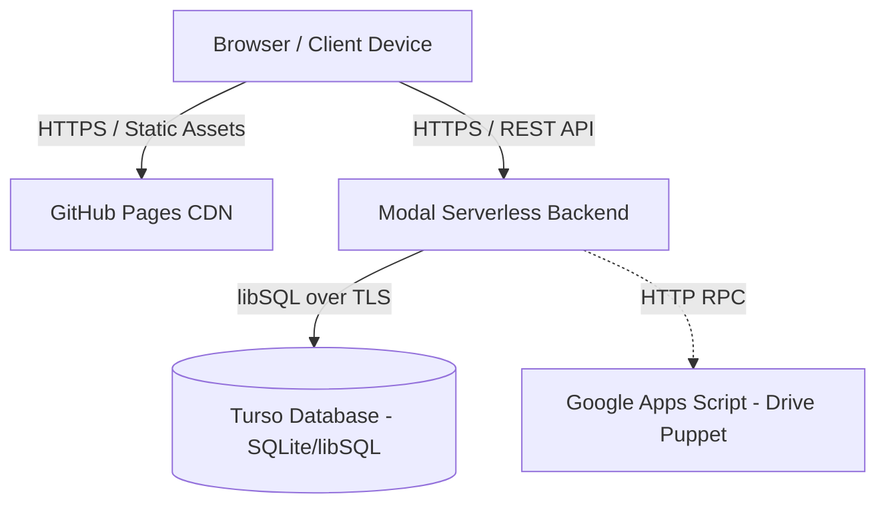

# Production Deployment Runbook

**System:** 72nd Annual CAJCL State Convention Platform  
**Target Environment:** Production (`state.uhsjcl.org`)  
**Estimated Provisioning Time:** 45–60 minutes  

---

## 1. System Topology & Service Architecture

The platform runs on a serverless, decoupled architecture designed to operate within free/low-cost tiers:



| Service Component | Functional Role | Infrastructure Tier |
| :--- | :--- | :--- |
| **GitHub Pages** | Static asset hosting (HTML, CSS, JS, Fonts). | Free tier |
| **Modal** | Serverless Python compute (FastAPI backend + WeasyPrint PDF workers). | $30/month credit tier |
| **Turso** | Distributed libSQL (SQLite) relational database (`aws-us-east-1`). | Free tier (5 GB, 500M reads/mo) |
| **Google Apps Script** | Scoped agent for Drive file ingestion (pre-convention contest uploads). | Workspace execution quota |

---

## 2. Prerequisites & Environment Configuration

### Local Environment Setup
Work within a single repository clone. Native tooling on macOS, Linux, and Windows (PowerShell) is fully supported.

```bash
# Clone and enter workspace
git clone https://github.com/tech-ovo/CAJCL-2027.git
cd CAJCL-2027

# Initialize virtual environment
python3 -m venv .venv
source .venv/bin/activate  # Windows PowerShell: .venv\Scripts\Activate.ps1

# Install core and deployment dependencies
pip install -r backend/requirements.txt
pip install modal
```

*Note for Windows users:* If PowerShell blocks script execution, run:  
`Set-ExecutionPolicy -Scope CurrentUser RemoteSigned`

---

## 3. Step-by-Step Deployment Pipeline

### Phase 1: Database Provisioning (Turso)
1. Install the Turso CLI and authenticate:
   ```bash
   curl -sSfL https://get.tur.so/install.sh | bash
   turso auth signup
   ```
2. Provision production and staging instances in `aws-us-east-1` (co-located with Modal compute):
   ```bash
   turso db create cajcl-2027 --location aws-us-east-1
   turso db create cajcl-2027-staging --location aws-us-east-1
   ```
3. Extract connection credentials:
   ```bash
   turso db show cajcl-2027 --url
   turso db tokens create cajcl-2027
   ```
4. *(Optional)* Mint platform usage token for dashboard telemetry:
   ```bash
   turso auth api-tokens mint cajcl-usage --org "<your-org-slug>"
   ```

---

### Phase 2: Secrets Configuration (Modal)
1. Authenticate the Modal CLI:
   ```bash
   modal setup
   ```
2. Generate an immutable cryptographic pepper (used for login token HMACs):
   ```bash
   export CODE_PEPPER="$(python3 -c 'import secrets; print(secrets.token_urlsafe(48))')"
   # Securely record CODE_PEPPER in a team password manager
   ```
3. Provision the Modal secret bundle:
   ```bash
   modal secret create cajcl-2027 \
     CODE_PEPPER="$CODE_PEPPER" \
     TURSO_DATABASE_URL="<your-turso-database-url>" \
     TURSO_AUTH_TOKEN="<your-turso-auth-token>" \
     CAJCL_ENV="production" \
     TURSO_PLATFORM_TOKEN="<optional-platform-token>" \
     TURSO_ORG="<your-org-slug>" \
     TURSO_DB_NAME="cajcl-2027"
   ```

---

### Phase 3: Backend Deployment & Schema Initialization
1. Deploy the backend application to Modal:
   ```bash
   modal deploy backend/app.py
   ```
2. Validate environment bindings and database connectivity:
   ```bash
   modal run backend/app.py::doctor
   ```
   *Expected output:* `connection OK - database is empty, so run setup next`.

3. Initialize schema and execute migration suite:
   ```bash
   # Production initialization (Empty tables + baseline settings, no dummy data)
   modal run backend/app.py::setup --no-seed

   # Staging / Development initialization (Wipes and loads full demo dataset)
   # modal run backend/app.py::setup --reset
   ```

---

### Phase 4: Administrative & Board Account Provisioning
1. Construct `board.json` in the project root (gitignored). Define initial administrative stakeholders:
   ```json
   [
     {
       "first": "Lead",
       "last": "Administrator",
       "type": "adult",
       "title": "Technology Commissioner",
       "school": "University High School",
       "city": "Irvine",
       "roles": ["sponsor", "admin"]
     },
     {
       "first": "Student",
       "last": "President",
       "type": "delegate",
       "title": "Convention President",
       "school": "University High School",
       "city": "Irvine",
       "roles": ["admin"]
     }
   ]
   ```
2. Ingest administrative accounts:
   ```bash
   modal run backend/app.py::board --create-schools
   ```
3. Credentials are saved to `board-codes.txt`. Distribute these login tokens directly to board officers.

*Account Recovery & Maintenance Utility:*
- To regenerate `board.json` from the live database: `modal run backend/app.py::recover_board`
- To batch-reissue board credentials: `modal run backend/app.py::board --new-codes`
- To migrate legacy credentials: `modal run backend/app.py::retire_adm_codes`

---

### Phase 5: Domain Configuration & Cross-Origin Rules
1. **Frontend Endpoint Mapping:** Update `frontend/public/config.js`:
   ```javascript
   window.CAJCL_API_URL = "https://<modal-org-name>--cajcl-2027-web.modal.run";
   ```
2. **CORS Whitelist:** Ensure target domains are present in `ALLOWED_ORIGINS` within `backend/api.py`:
   ```python
   ALLOWED_ORIGINS = [
       "https://state.uhsjcl.org",
       "https://<github-user>.github.io",
       "http://localhost:8080",
   ]
   ```
3. If changes were made to `backend/api.py`, redeploy Modal:
   ```bash
   modal deploy backend/app.py
   ```

---

### Phase 6: CI/CD Pipeline & GitHub Pages Publication
1. Navigate to GitHub Repository **Settings → Secrets and variables → Actions** and add:
   - `MODAL_TOKEN_ID`
   - `MODAL_TOKEN_SECRET`
   - `TURSO_DATABASE_URL`
   - `TURSO_AUTH_TOKEN`
2. Under **Settings → Pages**, set **Source** to **GitHub Actions**.
3. Verify `frontend/CNAME` contains `state.uhsjcl.org`. Confirm DNS CNAME record points `state` to `<github-username>.github.io`.
4. Trigger production pipeline by pushing to `main`:
   ```bash
   git push origin main
   ```
   The workflow executes font assembly, statistics snapshot baking, schema migration validation, and CDN deployment.

---

## 4. Pre-Flight Verification Checklist

Execute these validation tests prior to announcing registration availability:

- [ ] **Health Probe:** `curl -sSf https://<modal-endpoint>/health` returns `{"ok": true}`.
- [ ] **Public Telemetry:** `curl -sSf https://<modal-endpoint>/public/stats` returns initialized integer values.
- [ ] **DNS & TLS:** `https://state.uhsjcl.org` resolves securely over HTTPS without SSL warnings.
- [ ] **Administrative Authentication:** Lead administrator logs in successfully via their designated login token.
- [ ] **Roster Ingestion Test:** Ingest a sample 3-person roster on a test chapter, preview output, confirm commit.
- [ ] **Credential Generation:** Verify packet generation, QR encoding, and print stylesheet formatting.
- [ ] **Mobile Sign-In:** Confirm QR code scans on iOS and Android devices, successfully authenticating into the portal.
- [ ] **Invoice Engine:** Verify dynamic calculations on delegate fee adjustments ($140/delegate; adult chaperone ratio 1:10).

---

## 5. Performance, Capacity & Cost Management

### Resource Cost Breakdown
- **Compute (Modal):** Billed by container runtime seconds. Active web containers cold-start in ~2–4s.
- **Database (Turso):** Free tier absorbs up to 500M row reads/month. Projected peak load across registration cycle is <15M reads.
- **Storage:** Minimal footprint (~25 MB total database size).

### Warming Strategy
To avoid cold-start delays during critical operational windows (Board Meetings, Registration Deadlines, Convention Weekend):
1. Sign in as Administrator.
2. Navigate to **Settings → Operations → Keep Warm**.
3. Select **Keep warm for 6 hours**.
4. *Convention Weekend:* Set `LIVE_GRADING = True` in `backend/app.py` and redeploy to enable real-time competition worker schedules. Revert to `False` post-event.

---

## 6. Disaster Recovery & Offline Fallback Plan

In the event of an upstream infrastructure outage or venue connectivity failure during the convention:

1. **Local Standalone Mode:**
   ```bash
   # Launch local backend against local SQLite database
   uvicorn backend.api:app --host 127.0.0.1 --port 8000 &

   # Launch static web server
   python3 -m http.server 8080 --directory frontend/public &
   ```
2. **Client Redirection:** Set `window.CAJCL_API_URL = "http://127.0.0.1:8000"` in `frontend/public/config.js`.
3. **Database Portability:** LibSQL databases export directly to standard SQLite files (`.db`), operable locally with standard tools (`sqlite3`, DB Browser for SQLite) without data conversion.
