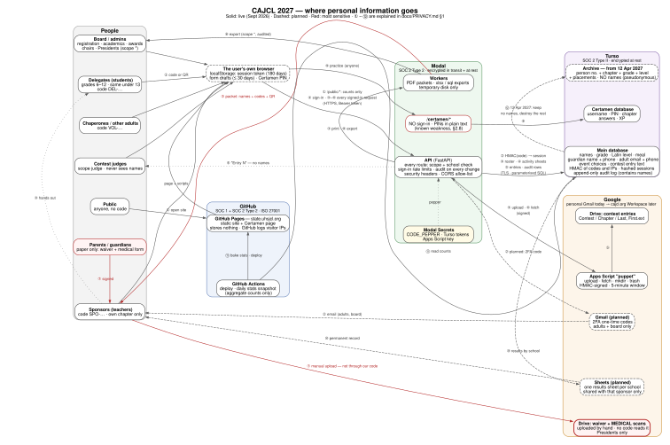

# Privacy, security and compliance

*The 72nd CAJCL State Convention website — `state.uhsjcl.org`*
*Prepared 25 September 2026 · Next review due by 25 September 2027*

> **Status: DRAFT, not yet adopted.** Nothing here is legal advice. It was written
> by reading this repository's code and the primary text of each law, then
> asking the technology commissioners every question the code could not
> answer. Before the notice in §4 or the form in §5 goes to a single family or
> school, the items in **§8 Open decisions** must be settled, and CAJCL should
> ask a lawyer to read §6. Where a law is ambiguous about whether it reaches
> us, this document says so instead of choosing the convenient answer.

This is the one document to hand to a district reviewer, a principal, a parent
who asks, or next year's commissioners. It has eight parts:

| § | What | Who it is for |
| --- | --- | --- |
| [1](#1-data-flow) | One-page diagram of where personal information goes, and the twelve flows explained | everyone |
| [2](#2-privacy-and-security-features) | Every safeguard; each platform's compliance status; what we store; the retention policy; incident response | reviewers, board |
| [3](#3-how-the-website-works) | How the site works, with links to the technical docs | reviewers, next year |
| [4](#4-privacy-notice-for-students-and-parents) | **The privacy notice** for students and parents | families |
| [5](#5-school-authorization) | **What a school agrees to**, and what CAJCL promises the school | principals, sponsors |
| [6](#6-the-law-provision-by-provision) | COPPA, FERPA, SOPIPA, AB 1584 and other California law, provision by provision | reviewers, lawyer |
| [7](#7-privacy-policies-worth-comparing) | Real privacy policies of comparable services, for comparison | whoever edits §4 |
| [8](#8-open-decisions-and-action-items) | What is still undecided or unbuilt | board |

---

## How this document was made

Written out because you asked to see the process, not only the result, and
because next year's commissioners will need to repeat it.

1. **Read the code, not the old docs.** Four parallel read-throughs of the
   repository: (a) sign-in, sessions, authorization, logging, headers;
   (b) every database column that holds personal information, and every place
   anything is deleted, backed up or exported; (c) every outside service the
   code calls — Apps Script, Drive, Turso, GitHub — and every page and what it
   shows to whom; (d) the text of each law and each vendor's security page.
   Every claim below was traced to a file and line; the most serious ones were
   re-checked by hand.
2. **Asked what the code cannot know.** Who legally runs the site, CAJCL's tax
   status, which Google account holds files, what the parent's waiver says,
   when deletion happens, what is archived, whether names are published, who
   has access to the platform accounts. The answers are recorded in §8's
   "Decided" list so nobody has to ask again.
3. **Read each law's actual text** — eCFR and Cornell LII for COPPA and FERPA,
   leginfo.legislature.ca.gov for California, the FTC's own FAQ for how the FTC
   reads COPPA in schools — rather than summaries. Quotes below are from those
   texts.
4. **Decided, for each law, whether it binds us** (§6.0), because the answer is
   different for each and the reason matters more than the answer.
5. **Mapped each provision to what we actually do**, marking each **Met**,
   **Partly**, **Gap**, or **N/A**. A review that finds no gaps was not a
   review; this one found several (§2.8).
6. **Updated the existing docs** that had fallen out of date:
   [`SECURITY.md`](SECURITY.md), [`TODO.md`](TODO.md),
   [`RUNBOOK.md`](RUNBOOK.md), [`DEPLOY.md`](DEPLOY.md),
   [`stack.md`](stack.md), [`structure.md`](structure.md) and the
   [`README`](../README.md).

### Words used throughout

| Term | Meaning here |
| --- | --- |
| **Operator** | Whoever runs a website and collects personal information through it. Here: **CAJCL**, a 501(c)(3), through its technology commissioners. |
| **Child** | Under COPPA, a person **under 13**. Delegates start in grade 6, so some are 11 or 12. |
| **Pupil / student** | Any delegate, grades 6–12. California's laws protect all of them, not only under-13s. |
| **Personal information (PI)** | Anything that identifies a specific person or can be linked to one. Each law defines it slightly differently (§6). |
| **Education record** | FERPA's term for records a *school* keeps about a student. CAJCL is not a school, which matters (§6.2). |
| **Directory information** | Items a school may release without consent after telling parents they can opt out: typically name, grade, activities, awards. |
| **De-identified** | Nobody — not even with other information to hand — could reasonably work out who a record is about. |
| **Pseudonymous** | Names removed, but a key exists somewhere that maps the record back to a person. **Not the same as de-identified.** |
| **Service provider / processor** | A company that stores or processes data *for* us: GitHub, Modal, Turso, Google. |
| **DPA** | Data Processing Agreement: the contract in which a service provider promises how it will treat our data. |
| **SOC 2 Type II** | An independent auditor's report that a company's security controls worked over a period of months, not just on one day. |

---

## 1. Data flow

**Print it:** [`privacy/data-flow.pdf`](privacy/data-flow.pdf) — one page, US
Letter landscape. **Edit it:** [`privacy/data-flow.dot`](privacy/data-flow.dot),
then re-render with `dot -Tsvg` and `dot -Tpdf` (commands at the top of the
file). Solid lines are live today; dashed lines are planned; red marks the most
sensitive data.

### The twelve flows, step by step

**① Anyone opens the site.** The browser downloads static pages from GitHub
Pages. The public pages then ask Modal for `/public/stats`, `/public/convention`
and `/public/announcements`: aggregate counts, convention facts and the banner.
**No unauthenticated request returns a person's name.** GitHub logs the visitor's
IP address for its own security purposes ([GitHub docs](https://docs.github.com/en/pages/getting-started-with-github-pages/what-is-github-pages)); we cannot switch that off.

**② Sign-in.** Everybody signs in with one access code, `DEL-…`, `SPO-…` or
`VOL-…`, typed or scanned from the QR on their printed sheet (the QR puts the
code in the URL *fragment*, which never reaches a server log, and the page
removes it immediately). Modal computes `HMAC-SHA256(pepper, code)` and looks
that up in Turso — the code itself is never stored anywhere. On success Modal
creates a 256-bit random session token, stores only its SHA-256 hash, and
returns the token, which the browser keeps in `localStorage` for up to 180 days.
*Planned, not built:* a second step for adults and the board — Modal asks Apps
Script on the convention's Google account to email a one-time code, which the
person types in ([`SECURITY.md` §7](SECURITY.md#7-would-two-factor-authentication-help)).
Delegates will not get a second factor: we hold no email for them, by design.

**③ A sponsor builds the roster.** The sponsor pastes names; Modal previews
the parse without saving anything, then commits it to Turso in one audited
transaction (protected against double-submission by a unique key). Modal renders
the **packet** — each person's name, grade, Latin level, person number, access
code and QR — as HTML or, through a worker, PDF. The packet is the one place a
code exists in readable form, and it exists on paper. The sponsor hands each
sheet to its owner.

**④ Delegates and adults fill in their sheets.** A delegate chooses tests,
events and a meal; an adult gives email, cell phone, meal, Latin knowledge,
availability and volunteer roles. Each save is a `PUT` to Modal, written to
Turso with an audit entry. Unsaved drafts stay in that browser's `localStorage`
for up to 30 days.

**⑤ A contest entry is uploaded.** The delegate's browser sends the file
(base64 inside JSON, 20 MB cap) to Modal. Modal checks the file's real type
against its extension, counts words for Word and text files, then calls the Apps
Script "puppet" with an HMAC-signed request that expires after five minutes.
Apps Script, running as the convention's Google account, files it in Drive under
`Contest / Chapter / Last, First.ext` and returns a file ID, which Modal stores.
Replacing or withdrawing an entry moves the old file to Drive's trash.

**⑥ A judge downloads and ranks.** Modal asks Apps Script to `fetch` the file
and streams it to the judge as `Entry 123.pdf` with `Cache-Control: no-store`.
**Judges never receive a name, a chapter or the original file name.** Their
ranked ballot goes to Turso. Sponsors can download their own chapter's entries
through a parallel route that checks the entry's school.

**⑦ Paper forms (outside the code).** A parent signs the Student Waiver and
the CAJCL Medical Information form. The sponsor scans them and uploads the
scans **by hand** to a Drive folder that only the Convention Presidents can open
and **no code in this repository can read**. The website records only the
sponsor's tick that each form arrived. This is deliberate: medical information
about minors should not be reachable by anything we wrote.

**⑧ The board exports.** A holder of scope `*` can export the database as
Excel or SQL, *full* or *anonymised* (names, contact details, free text and
file pointers blanked). The export is audited and downloads to that person's
computer.

**⑨ Certamen practice.** Anyone can open the practice arena, choose a
username, PIN and chapter, and play. The page calls Modal's `/certamen/*`
routes, which read and write a **separate** Turso database. **These routes have
no sign-in and store the PIN in plain text** — see §2.8.

**⑩ Planned: results to schools.** After results are final, each school gets
a Google Sheet of its own students' scores and placements, shared with that
school's sponsor only, as the school's permanent record.

**⑪ Build and deploy.** GitHub Actions deploys the site, runs database
migrations, and once a day reads aggregate counts from Turso to bake into the
public welcome page. Nothing personal is baked in.

**⑫ Planned: 12 April 2027.** 30 days after the convention's last day, after
⑩, personal information is deleted (§2.4). What remains is an archive of
**person number + chapter + grade + Latin level + placements**, with no names
and no sign-ups.

---

## 2. Privacy and security features

### 2.1 The four platforms, and what each has certified

| Platform | What it holds for us | Certifications and encryption | Contract (DPA) | Our account |
| --- | --- | --- | --- | --- |
| **GitHub** (Pages + Actions) | The site's code and static files; no personal data. Visitor IP logs, kept by GitHub. Actions holds Turso and Modal tokens as encrypted secrets. | SOC 1 and SOC 2 Type 2; ISO 27001 ([GitHub](https://github.blog/news-insights/product-news/github-has-soc-1-and-soc-2-type-2-reports/), [trust center](https://github.com/trust-center)). Whether Pages specifically is inside the audit scope: **unverified**. | [GitHub DPA](https://github.com/customer-terms/github-data-protection-agreement) | 2FA on; two people. |
| **Modal** (API, workers, secrets) | Processes every request; holds the pepper and tokens in Modal Secrets; exports exist only on temporary container disk. | SOC 2 Type 2; "All user data is encrypted in transit and at rest"; TLS 1.3 ([Modal security](https://modal.com/docs/guide/security)). By default functions may run across several clouds; a region can be pinned ([regions](https://modal.com/docs/guide/region-selection)). | [Modal DPA](https://modal.com/legal/dpa); report via [trust.modal.com](https://trust.modal.com) | 2FA on; two people. |
| **Turso** (both databases) | Every personal field in §2.3; the Certamen database. | SOC 2 Type II, announced July 2024 ([Turso](https://turso.tech/blog/turso-achieves-soc2-compliance)); volume-level encryption at rest on all databases ([docs](https://docs.turso.tech/tursodb/encryption)); region chosen per database. | Offered on paid plans through [trust.turso.tech](https://trust.turso.tech); **whether our plan has one: unverified.** | 2FA on; two people. |
| **Google** (Apps Script + Drive) | Contest entry files; the waiver and **medical** scans; planned 2FA email and results sheets. | Google's infrastructure encrypts at rest (AES-256) and in transit ([Google](https://cloud.google.com/docs/security/encryption/default-encryption)). The ISO 27001/27018 and SOC 2/3 certifications Google publishes are for **Workspace and Cloud**, not personal accounts. | **None today.** A personal Gmail account runs under Google's consumer terms: no DPA, no education commitments. | 2FA on; two people. **Moving to the `cajcl.org` Workspace** (edition unknown). |

**The Google row is the weakest link, and the most sensitive files sit in
it.** Only the Workspace **for Education** terms carry Google's FERPA
"school official" clause, its COPPA clause and its no-ads commitment
([terms](https://workspace.google.com/terms/education_terms/)); those terms are
open to "non-profit entities" as well as schools. A Business or Nonprofits
Workspace still gets Google's [Cloud Data Processing Addendum](https://cloud.google.com/terms/data-processing-addendum/),
which is what SOPIPA §22584(b)(4)(E) and COPPA §312.8(c) need from a service
provider. A personal Gmail gets neither. See §8, item 1.

### 2.2 Safeguards, one by one

**Sign-in**

| Safeguard | Detail | Where |
| --- | --- | --- |
| No passwords for the site | One code per person, `PPP-XXXXX-XXXXX`: nine random characters from a 31-symbol alphabet plus a check symbol, **44.6 bits**, drawn with `secrets.choice`. | `backend/lib/codes.py` |
| Codes never stored | Only `HMAC-SHA256(pepper, code)`. The pepper lives in Modal Secrets — not in the database, the repository or the frontend. A stolen database does not reveal a single code. | `codes.py:176`, `auth.py:71` |
| Session tokens | 256 bits from `secrets.token_urlsafe(32)`; stored as a SHA-256 hash; valid 180 days, fixed at creation. | `auth.py:35,352` |
| Regenerating a code | A sponsor or chair can reissue anyone's code; the old code stops working **and every session made with it is revoked** at once. | `roster.py:409` |
| Sign-out and revocation | Sign-out on every page revokes the session on the server; the account page lists each session (device, last seen) and revokes any one. Cancelling a person or changing their admin role revokes all their sessions. | `auth.py:517–546` |
| Rate limits | 5 wrong attempts on one code per hour; 10 wrong attempts from one address per 15 minutes; then HTTP 429. Failed attempts are recorded and audited even though the request fails. | `auth.py:39–40, 265–286` |
| Impersonation (support) | An admin can view the site as someone else after re-entering their own code; read-only, 30 minutes, audited at start and end. | `auth.py:36, 569–588` |
| **Two-factor** | **Planned, not built** — adults and board only, one-time code by email from the Workspace account, before codes are sent to chapters. | `TODO.md` §1 |

**Who can see what**

| Safeguard | Detail |
| --- | --- |
| Every route declares its scope | 86 guarded routes. The test suite hits every one with no credential (401), the wrong scope (403) and the wrong school (403); **a route added without a guard fails CI.** Seven Certamen routes and a handful of public ones are on an explicit allow-list. (`backend/tests/test_endpoints.py`) |
| Scopes only through roles | `person_roles → roles → role_scopes`; there is no table giving a scope to a person directly. |
| School isolation | Sponsor, delegate and chapter scopes see only their own school (plus schools a chair explicitly grants a sponsor). |
| Judges are blind | Scope `judge` sees entries as `Entry N`, never names, chapters or file names; anybody holding the Academics scope cannot also judge. |
| Medical data unreachable | The scan folder is outside the code entirely; only scope `*` can even see its folder ID. |

**The server and the page**

| Safeguard | Detail |
| --- | --- |
| HTTPS only | Browser ↔ GitHub Pages, browser ↔ Modal, Modal ↔ Turso, Modal ↔ Apps Script are all TLS. The browser never holds a database credential. |
| Security headers | `X-Frame-Options: DENY`, `X-Content-Type-Options: nosniff`, `Referrer-Policy: strict-origin-when-cross-origin`, CSP `frame-ancestors 'none'; base-uri 'none'` on every API response. |
| Content-Security-Policy on the site | `default-src 'self'`, scripts only from the site plus one hashed inline script, connections only to the site and the Modal API, `form-action 'none'`, `object-src 'none'`. (Not on the Certamen page — §2.8.) |
| CORS allow-list | Only `state.uhsjcl.org` and the GitHub Pages origin; credentials off. Defence in depth only — the scope check is the real control. |
| API docs off | `/docs`, `/redoc`, `/openapi.json` disabled in production. |
| SQL injection | Every registration query is a named, parameterised statement in `backend/queries/*.sql`, and a test refuses any of them built by formatting. Two places outside that folder build statements from fixed table names or integer-cast values — the Certamen module and the export worker — and no user text reaches them unparameterised. |
| Cross-site scripting | The site's JavaScript never uses `innerHTML` (checked by search; no test enforces it); text is inserted as text nodes. |
| Uploads | 20 MB cap; strict base64; allowed types pdf, jpg, png, gif, tiff, docx, txt; the file's real contents must match its extension; the stored MIME type is decided by the server. |
| Body-size limit | 1 MB on every request except contest uploads. |
| Audit on every change | A database transaction that changes data without writing an audit row **refuses to commit**; the audit log is append-only (database triggers block edits and deletes). |
| No third parties in the page | Fonts are self-hosted. No analytics, no ads, no trackers, no CDNs, no cookies. |

**What we deliberately never collect:** delegate email addresses (the database
refuses to store one), home addresses, dates of birth, payment card details
(chapters pay by cheque), and medical details (paper, outside the code).

### 2.3 What we store

**Main database** (Turso), one row per person in `people`, plus related tables.

| Data | Delegates (students) | Adults (sponsors, chaperones) | Board / judges | Required? |
| --- | --- | --- | --- | --- |
| First, middle, last name, suffix | ✔ | ✔ | ✔ (they are also people rows) | first + last required |
| Chapter (school) and person number | ✔ | ✔ | ✔ | required |
| Grade (6–12), Latin level | ✔ | — | — | optional |
| Meal preference | ✔ | ✔ | ✔ | optional |
| Parent/guardian name and phone | ✔ | — | — | optional |
| Cell phone | possible (see §2.8) | ✔ | ✔ | optional |
| Email, Latin knowledge, availability note, volunteer roles | — | ✔ | ✔ | optional |
| Tests, events and activities chosen | ✔ | ✔ | — | — |
| Contest entries: title, text, translation, link, word count, file pointer, original file name | ✔ | — | — | — |
| Judges' ballots and free-text comments | — | — | ✔ | — |
| Paper-form ticks (waiver and medical *arrived*; no content) | ✔ | medical only | — | — |
| Code HMAC, session hashes, user agent, IP HMAC | ✔ | ✔ | ✔ | automatic |
| Audit log: who did what, as a sentence that **includes names** | ✔ | ✔ | ✔ | automatic |
| Pasted roster text, exactly as pasted | ✔ | ✔ | — | automatic |
| Payments: cheque number, note | — | per chapter | — | — |

**Certamen database** (Turso, separate): username, PIN, chapter (free text),
level, points by category, each answer given and whether it was right. No
email. Not connected to the registration identity.

**Google Drive:** contest entry files named `Last, First.ext`; waiver and
medical scans (hand-uploaded).

**Browsers:** the session token, form drafts (≤ 30 days), theme; for Certamen,
the username, PIN and stats.

### 2.4 Written data retention policy

*Required in writing by COPPA §312.10 (which applies to us voluntarily, §6.1)
and promised in the notice in §4. Adopted by: `[BOARD — DATE]`.*

**Purposes.** We collect personal information only to register students and
adults for the 2027 CAJCL State Convention, to run its tests, events and
pre-convention contests, to bill chapters, to keep attendees safe on the day,
and to give each school a record of its own students' results.

**Business need.** Each item in §2.3 is needed for one of those purposes up
to the day results are final. None of it is needed after each school has its
record.

**Timeframe.** Personal information is deleted on **12 April 2027**, 30 days
after the convention's last day, except as the table says.

| Data | Kept until | How it is destroyed |
| --- | --- | --- |
| Everything in the main database (names, contact details, choices, entries' text, ballots, payments, audit log, pasted rosters, sessions) | **12 April 2027** | After the archive is extracted and each school has its results: `turso db destroy` on the 2026–27 database, then delete `CODE_PEPPER` from Modal Secrets. (The audit log cannot be edited row by row, by design, so the database is destroyed whole.) |
| Failed and successful sign-in attempts | 7 days, rolling | A daily job already deletes them. |
| Contest entry files in Drive | **12 April 2027** | Delete the contest root folder **and empty Drive's trash** (trash alone keeps files for 30 more days). |
| **Medical form scans** | **12 April 2027** | Permanent deletion from Drive, trash emptied. |
| Signed waiver scans (no medical content) | `[DATE SET BY BOARD OR INSURER]` | Permanent deletion from Drive. Kept longer because a waiver is a liability release. |
| Per-school results sheets | Given to the school; CAJCL's own copy deleted **12 April 2027** `[CONFIRM]` | Sponsor makes their own copy or takes ownership; CAJCL deletes its copy. |
| Board exports on personal computers; `codes.txt`, `board-codes.txt`, `board.json` | **12 April 2027** | Deleted by whoever holds them, confirmed to the privacy officer in writing. |
| Printed packets and code sheets | After check-in | Shredded (Cal. Civ. Code §1798.81). |
| Certamen profiles and answers | `[OPEN — see §8]` | — |
| **Archive:** person number + chapter + grade + Latin level + placements | Indefinitely, not public, board and commissioners only | — |
| GitHub Pages visitor logs; Modal platform logs | GitHub's and Modal's own retention | Not under our control; no request contents are logged by our code. |

**Is the archive still personal information?** It has no names. But the person
number (`07014` = chapter 07, 14th person) is printed next to each name on
every sponsor's packet and will be on each school's results sheet, and it is
deliberately guessable. So the archive is **pseudonymous, not de-identified**:
anyone holding a packet or results sheet can tell which row is whom, and a small
chapter's lone 6th-grader is identifiable from chapter, grade and level alone.
How each law treats that:

- **COPPA:** probably *not* personal information. §312.2 lists what counts —
  name, contact details, photos, "persistent identifier… used to recognize a
  user over time and across different websites", and information "combined
  with" one of those. A chapter-local sequence number is none of these.
- **FERPA:** PII includes information "linked or linkable to a specific
  student" that would let "a reasonable person in the school community"
  identify the student. By that test the archive **is** PII to anyone at the
  school. (FERPA binds the school, not CAJCL, but it shapes what schools will
  ask us.)
- **SOPIPA:** "covered information" explicitly includes "pupil identifiers"
  and "test results". The archive plausibly **is** covered information.
- **Plain-language consequence:** the notice (§4) tells families the archive
  exists and what is in it. Treat it with the same access limits as the live
  database.

**Deletion on request, before 12 April.** See §4 for what families are told.
**The code cannot fully do this today.** A person can be cancelled and their
fields edited, but their name stays in the append-only audit log, and a rename
is itself logged with the old name. A "redact this person" operation must be
built before registration opens (§8, item 5).

### 2.5 Backups

**Honest status: there is no durable backup.** A manual export (Settings →
Operations) downloads a full copy to one person's computer; the automatic
export, used only during live grading, writes to a Modal container's temporary
disk, which is discarded. Turso's own point-in-time recovery, if our plan has
it, has not been checked or tested. A backup plan must say where copies live,
who can open them, and that they are destroyed on 12 April 2027 with
everything else (§8, item 7).

### 2.6 Logging and monitoring

- **Audit log:** every change, by whom (and by whom on their behalf, if
  impersonating), with the actor's role at the time and a hashed IP. The
  Presidents can read it under Settings → Audit. Reads are not logged.
- **Sign-in log:** every attempt, success or failure, with hashed IP, for
  7 days; visible to the Presidents with IP hashes shortened.
- **IP addresses are never stored in readable form:** `HMAC(pepper, ip)`, so
  the 4-billion IPv4 addresses cannot be brute-forced from a stolen database.
- **Not monitored:** there is no alerting. Somebody has to look (§8, item 8).

### 2.7 Incident response

*Named coordinator: `[PRIVACY OFFICER — NAME, TITLE, EMAIL]`. Technical
responders: the two technology commissioners.*

**What counts.** Anybody other than the right person seeing, copying,
changing or deleting personal information; a leaked credential (a printed
packet, an admin code, a Turso or Modal token, the pepper, the Gmail
password); or a report of either from anyone.

1. **Write it down** — who reported what, when. Keep notes through every step.
2. **Contain** (the same hour):
   - A leaked person's code → regenerate it (revokes their sessions).
   - A leaked chapter packet → regenerate that chapter's codes and reprint.
   - A leaked admin code → remove the person's roles, regenerate the code.
   - A leaked Turso token → rotate it in Turso, update the Modal secret and the
     GitHub Actions secret, redeploy.
   - A leaked Modal token → revoke it in Modal ([`DEPLOY.md`](DEPLOY.md)).
   - A leaked pepper → rotate it; **every code must be reissued and
     reprinted** ([`RUNBOOK.md` §7](RUNBOOK.md#7-secrets-and-what-breaks-if-you-change-one)).
   - A leaked Apps Script key → change `SHARED_KEY` and `APPS_SCRIPT_KEY`
     together.
   - A compromised Google account → change the password, sign out all
     sessions, check Drive sharing and the trash.
   - Anything serious → switch the site off from Modal until you understand it.
3. **Assess:** which records, whose, how many, and whether they were actually
   read or copied. The audit log shows every change; Turso and Modal dashboards
   show access.
4. **Notify.**
   - **Legally required** (Cal. Civ. Code §1798.82) when unencrypted
     "personal information" in the statute's narrow sense was, or is reasonably
     believed to have been, acquired. That means a name plus **medical
     information** (the scans), or a **username plus password** (Certamen
     username + PIN). Notify each affected California resident "within 30
     calendar days of discovery". The notice is titled **"Notice of Data
     Breach"** and uses the headings *What Happened · What Information Was
     Involved · What We Are Doing · What You Can Do · For More Information*.
     If more than 500 Californians are affected, send a sample to the Attorney
     General.
   - **Promised, though not legally required** for names and phone numbers
     alone: tell affected schools and families as soon as the facts are
     known, and no later than the same 30 days. Schools are told first, so
     sponsors can talk to families.
5. **Fix the cause**, add a test so it cannot recur, and record it in
   [`RISKS.md`](RISKS.md).
6. **Review** within two weeks: update this document and §2.8.

### 2.8 Known weaknesses

Listed because the point of a review is to find them.

| | Weakness | Risk | Status |
| --- | --- | --- | --- |
| 1 | **Certamen: anyone can overwrite any profile.** `POST /certamen/sync-user` replaces the PIN for any username without checking the old one. | Profile takeover. | Open — documented only, at the commissioners' decision |
| 2 | **Certamen: PINs in plain text**, returned by `/certamen/login`, with no rate limit on guessing. | A username + PIN is breach-notifiable (§2.7). | Open |
| 3 | **Certamen: anyone can wipe the question bank** with `POST /certamen/questions/batch` and `replace=true`. | Loss of the bank. | Open |
| 4 | Certamen page has no Content-Security-Policy; its routes are exempt from the guard test. | Weaker XSS defence there. | Open |
| 5 | **Medical scans in a personal Gmail's Drive**, under consumer terms, no DPA. | The most sensitive data under the weakest contract. | Open until the Workspace move |
| 6 | No durable backup (§2.5). | Data loss. | Open |
| 7 | Deletion tooling does not exist: no per-person redaction, no archive script (§2.4). | Cannot honour a deletion request fully. | Open |
| 8 | Pasted roster text is kept verbatim, including emails and phones the parser discarded. | Data we said we don't keep. | Open |
| 9 | Nothing stops a delegate's own cell phone being stored. | Contact data for under-13s. | Open |
| 10 | 180-day sessions on shared school Chromebooks; no "sign out everywhere" button. | A forgotten session shows a roster. | Accepted until 2FA shortens it |
| 11 | The per-address rate limit trusts the first `X-Forwarded-For` value. Whether Modal's proxy overwrites it is unverified. | An attacker might dodge the per-IP limit (the per-code limit still holds). | Check |
| 12 | Apps Script signs the request's operation, folder, name and file ID, but not the file's bytes. | A captured request could be replayed with other contents within five minutes. | Low |
| 13 | No alerting (§2.6). | Slow detection. | Open |
| 14 | The runbook used to call anonymised exports safe to paste into AI tools. They are pseudonymous (person number + chapter + grade + level + choices). | A disclosure SOPIPA §22584(b)(4) may not allow. | Runbook corrected; keep to it |

### 2.9 Written information security program

*COPPA §312.8(b) asks for one in writing; this section is it. It applies to us
voluntarily (§6.1), but the same structure answers SOPIPA's and Civil Code
§1798.81.5's "reasonable security".*

| Requirement (§312.8(b)) | Ours |
| --- | --- |
| (1) Designate who coordinates it | `[PRIVACY OFFICER — NAME, TITLE]`, with the two technology commissioners as technical leads. |
| (2) Identify risks, at least annually | This document is the first assessment (25 Sept 2026): §2.8 and [`SECURITY.md` §4](SECURITY.md#4-what-would-have-to-fail). Next by 25 Sept 2027. |
| (3) Safeguards based on the data's volume and sensitivity | §2.2. Most sensitive (medical) is kept out of the code entirely; codes are never stored; names are behind per-school scope checks. |
| (4) Regularly test and monitor | The test suite runs on every change, including a wrong-scope and wrong-school attack on every route. Monitoring is a gap (§2.8 #13). |
| (5) Evaluate and modify at least annually | Review this document each September and after any incident (§2.7 step 6). |
| (c) Written assurances from service providers | Modal DPA; GitHub DPA; Turso: check the plan; **Google: none until the Workspace move.** |

---

## 3. How the website works

The full technical description lives in the repository, where it is kept
current with the code:

| Read | For |
| --- | --- |
| [`README.md`](../README.md) | Layout of the repository and the five rules everything follows (rule 5: no real student data in the public repository, ever). |
| [`structure.md`](structure.md) | What every part of the site does, for whom, in plain language. |
| [`stack.md`](stack.md) | Why each of the four platforms, and their limits. |
| [`schema.md`](schema.md) | Every table and column. |
| [`SECURITY.md`](SECURITY.md) | The security model in depth: codes, rate limits, scopes, what would have to fail. |
| [`RUNBOOK.md`](RUNBOOK.md) | Operating it: secrets, backups, when something breaks. |
| [`REGISTRATION.md`](REGISTRATION.md) | The guide for registration chairs, and the opening email to sponsors. |

**In one paragraph.** The site is a set of static pages on GitHub Pages. Every
page that shows a person's information fetches it from one API on Modal, which
is the only thing that can reach the database on Turso. Nobody has a username or
password: each person has one printed access code, which the server turns into
a session. Every request carries that session, and every API route checks both
the person's role and their school before answering. Files for pre-convention
contests are the one thing stored outside Turso: Modal hands them to a small
Google Apps Script, which files them in the convention's Google Drive. The
Certamen practice arena is a separate page with its own small database and its
own username-and-PIN profiles.

**Who sees what:**

| Person | How they get in | What they can see and do |
| --- | --- | --- |
| **Public** | No code | Welcome page (counts, dates, venue), resources, Certamen practice. No names. |
| **Delegate** | `DEL-` code on the sheet their sponsor hands them | Their own activity sheet and contest entries. A chapter leader also sees their chapter's teams and Publicity entry. |
| **Sponsor** | `SPO-` code emailed by a registration chair | Their own chapter only: roster (names, grade, level, guardian contact, form ticks), packets and codes, invoice, delegates' sheets and entries. |
| **Chaperone / other adult** | `VOL-` code on the sponsor's packet | Their own adult sheet. |
| **Registration chair** | Board code | Every chapter's roster, progress, payments, check-in; all contest submissions with names. |
| **Academics / Awards chair** | Board code | Counts and proctor lists per event; contest results with names. |
| **Contest judge** | Board-assigned role | Anonymous entries (`Entry N`) and their own ballots. Nothing else. |
| **Convention Presidents** (scope `*`) | Board code | Everything, including settings, roles, the audit log and exports. |

---

## 4. Privacy notice for students and parents

> *This is the notice to publish. It is written for families, so it repeats
> things said above in plainer words. Fill in every `[BRACKET]` before
> publishing; §8 lists them. COPPA §312.4(d) expects it to be linked, clearly
> labelled, from the home page and from every page that collects information —
> not yet done (§8, item 3).*

---

### Privacy Notice — CAJCL State Convention Registration

**Effective `[DATE]` · California Junior Classical League**

**The short version, for students.** Your teacher (your sponsor) puts your name
on our list so you can come to convention. You sign in with the code on your
sheet — there's no password and we never ask for your email. We use what you
tell us only to run the convention. We never sell it, never show you ads, and
never give it to anyone except the companies that run the website for us. On
**12 April 2027** we delete it. You or your parent can ask to see it, fix it,
or delete it sooner.

**Who we are.** The California Junior Classical League ("CAJCL") is a
non-profit 501(c)(3) organisation of school Latin and Classics clubs. We run
this website to register students and adults for the 72nd CAJCL State
Convention at University High School, Irvine, on 12–13 March 2027.
Contact: `[PRIVACY OFFICER — NAME, TITLE]`, `[EMAIL]`, `[PHONE]`,
`[CAJCL MAILING ADDRESS]`. You can also ask your chapter's sponsor, who can pass
any request to us.

**What we collect, and where it comes from.**

| About | Your sponsor gives us | You give us, by signing in | Collected automatically |
| --- | --- | --- | --- |
| **Students** | Name, grade, Latin level, meal choice, and (if the sponsor chooses) a parent or guardian's name and phone number | The tests, events and activities you choose; your meal choice; any pre-convention contest entry you upload | Your access code's fingerprint (not the code), when and from which device you signed in, and a scrambled form of your internet address |
| **Adults** | Name | Email, cell phone, meal choice, how much Latin you know, when you're available, which volunteer jobs you'd do | Same as students |

We **do not** collect student email addresses, home addresses, birth dates,
or payment card details. **Medical information and waivers never go into this
website:** they are paper forms. Your sponsor scans them into a separate,
locked Google Drive folder that only the Convention Presidents can open and no
part of the website can read.

Contest entries are your own work (art, poems, myths, slogans). If an entry
includes a photo of you, that photo is part of the entry.

**How we use it.** Only to run the convention: to register you, plan tests and
events, print name badges and sign-in sheets, bill your chapter, judge
contests, keep everyone safe on the day, and send your school its results.

**What we never do.**

- We **never** use information from this website for **advertising** of any
  kind, and we show no ads.
- We **never build a profile** of you, and never use your information to
  predict or decide anything about you beyond running the convention.
- We **never sell** your information, and **never disclose** it to anyone
  except as listed below.
- There are no trackers, analytics or cookies on this website.

**Photos taken at convention are different.** They are covered by the Student
Waiver your parent or guardian signs, not by this notice. That waiver gives
CAJCL permission to use a student's name and photograph "in all forms and media
for advertising, trade, and any other lawful purposes." This website does not
store convention photos.

**Who else sees it.**

- **Your sponsor** sees your chapter's list. **Board officers** who run
  registration, academics or awards see what their job needs. **Contest judges
  never see your name, your school or your file's name.**
- **Your school** receives a record of its own students' scores and placements
  after the convention.
- **Companies that run the website for us**, only to do that: GitHub (hosts the
  pages), Modal (runs the server), Turso (stores the database), and Google
  (stores contest files and the scanned forms). They are not allowed to use
  your information for anything else. GitHub records the internet address of
  every visitor to protect its service; we cannot switch that off.
- **Nobody else**, unless the law requires it or someone's safety depends on it.
- Winners' names are **announced aloud** at the awards assembly. They are
  **not posted online** by us.

**How long we keep it.** Until **12 April 2027**, 30 days after the convention
ends, after each school has its results. Then we delete it. Medical scans are
deleted the same day. Signed waivers are kept until `[DATE]`, because they are a
legal release. **What we keep after that:** a record, with **no names**, of
each person's number, chapter, grade, Latin level and placements, so CAJCL has
a history of its conventions. Anyone with your printed sheet, or your school's
results, could match your number to you, so we keep that record private.

**Your rights, and how to use them.** A parent or guardian — or a student
themself — can:

1. **See** what we hold about the student.
2. **Correct** anything wrong. Your sponsor can fix most things on the spot.
3. **Delete** it, or **stop** us collecting more. Deleting before convention
   means the student can no longer be registered.
4. **Remove something you posted.** Students can withdraw their own contest
   entry until the contest deadline from the *Contests* tab, which removes it
   and its file. For anything else, ask us. (Removing it from the website does
   not remove copies someone else already made, such as your school's results.)

**To ask**, email `[EMAIL]` or ask your sponsor. Tell us the student's name
and chapter. So we don't hand a child's information to a stranger, we will check
with the chapter's sponsor that the request comes from the student's family.
We will reply within `[N]` days `[PROPOSED — CONFIRM]`.

**Certamen practice.** The practice arena is optional, open to anyone, and
separate from registration. Please **do not use your real name** as your
username, and don't reuse a PIN from anything else. It stores your username,
PIN, chapter and answers. `[Retention: SEE §8]`.

**Keeping it safe.** Codes are never stored in readable form. Every page
checks that you may see what you asked for, and sponsors see only their own
chapter. Everything travels encrypted. If information about you is ever seen by
someone who shouldn't have seen it, we will tell your school and your family.

**Changes.** If we change this notice in a way that affects information we
already hold, we will tell sponsors, and ask again where the law requires it.

---

### 4.1 Suggested addition to the Student Waiver

The current waiver covers medical care, liability and photographs, but **says
nothing about the website**. One paragraph added to it would do three jobs at
once:

- the "direct notice" to parents that COPPA §312.4(c) describes;
- a **signed** parental consent (a signed form returned by scan is an approved
  method under §312.5(b)(2)(i));
- the FERPA consent a school needs to share records that are not directory
  information (§99.30: it must name the records, the purpose and the recipient).

> *Online registration.* I understand that my child's sponsor will enter my
> child's name, grade, Latin level and meal choice, and may enter my name and
> telephone number, on CAJCL's convention registration website; that my child
> will sign in with a printed access code to choose events and may submit
> contest entries; and that CAJCL uses this information only to run the
> convention and give my child's school its results, never for advertising, and
> deletes it by 12 April 2027 except for a record without names. I consent to
> my child's school disclosing, and to CAJCL collecting, this information for
> that purpose. The full notice is at `[URL]`. I may review or delete my
> child's information, or withdraw this consent, by writing to `[EMAIL]`.

**Timing matters.** Consent must come *before* a child's information is
collected online. Delegates currently receive codes in the packet, often before
waivers are returned. Either sponsors hold `DEL-` sheets for under-13 delegates
until the waiver is back, or the school authorisation in §5 covers the gap. That
choice is §8, item 4.

---

## 5. School authorization

### 5.1 What the FTC says about schools, and why it matters here

The FTC's [COPPA FAQ, Section N](https://www.ftc.gov/business-guidance/resources/complying-coppa-frequently-asked-questions)
explains when a school may consent **instead of** each parent:

- A school "may act as the parent's agent and can consent", but only where the
  information is collected "for the use and benefit of the school, and for no
  other commercial purpose" (N.1). If it will also be used for the operator's
  own commercial purposes, the operator must go to parents directly (N.2).
- The operator must give the school the same notice it would give a parent,
  and on request let the school review the data, have it deleted, and stop
  further collection (N.1).
- The operator must **not** say the school is responsible for COPPA (N.1).
- The decision is best made by the school or district, **not an individual
  teacher** (N.3). So the form below is signed by an administrator, with the
  sponsor co-signing.
- The FAQ lists what a school should ask (N.5). The answers are in §5.3.

**Two honest caveats.** First, COPPA probably does not bind CAJCL at all (§6.1),
so this is best practice, not compliance with an obligation. Second, the FAQ
imagines ed-tech used in class. A club's convention is a school activity, but
whether it is "for the use and benefit of the school" in the FAQ's sense is not
certain. That is why §4.1's signed parental paragraph is the stronger route,
and this form is the backstop.

### 5.2 The form

> **CAJCL State Convention — School Authorization for Online Registration**
>
> School: `______________` District: `______________`
> CAJCL chapter: `______________`
>
> **The school confirms that:**
>
> 1. Its JCL chapter is a school-recognised student activity, and the sponsor
>    named below is authorised to register its students for the 2027 CAJCL
>    State Convention.
> 2. It has received CAJCL's privacy notice (attached) and this document's
>    §2 summary of safeguards.
> 3. On behalf of the parents of its students under 13, and for the sole
>    purpose of convention registration, it authorises CAJCL to collect the
>    information described in the notice.
> 4. Disclosing each student's name, grade, Latin level, meal choice and (if
>    entered) a parent's name and telephone number to CAJCL is permitted by its
>    directory-information policy, or by the parent's signed consent, and no
>    parent of a registered student has opted out without having consented.
> 5. It will make CAJCL's notice available to parents on request.
>
> **CAJCL commits to the school that it will:**
>
> 1. Use student information **only** to run the convention and return
>    results to the school, and never for advertising, profiling or any
>    commercial purpose. (AB 1584 terms 3 and 9)
> 2. Never sell it, and disclose it only to the service providers named in
>    the notice, under contracts that forbid any other use. (SOPIPA
>    §22584(b)(3)–(4))
> 3. Treat the records as the school's: on the school's request, let it review
>    them, correct them, have them deleted, or stop further collection.
>    (AB 1584 terms 1, 4; SOPIPA §22584(d)(2))
> 4. Let students keep their own contest work: they submit copies, and can
>    withdraw entries until the deadline. (AB 1584 term 2)
> 5. Keep the safeguards in the attached summary, with a named person
>    responsible for them. (AB 1584 term 5)
> 6. Tell the school and affected families of any unauthorised disclosure
>    within 30 days of discovery. (AB 1584 term 6)
> 7. Delete the school's students' personal information by **12 April 2027**,
>    except the nameless archive the notice describes, and confirm in writing
>    on request. (AB 1584 term 7)
> 8. Cooperate with the school on any FERPA request about these records.
>    (AB 1584 term 8)
>
> Administrator: `________` Title: `________` Signature: `________` Date: `____`
> Sponsor: `________` Signature: `________` Date: `____`
> For CAJCL: `[PRIVACY OFFICER]` Signature: `________` Date: `____`

**Using it.** Send it with the opening email to sponsors
([`REGISTRATION.md` §4](REGISTRATION.md#4-email)). File the signed copies in
the board's Drive, not in the medical-scan folder. A district that sends its own
agreement instead — usually the **California Student Data Privacy Agreement**
([CA-NDPA v1.5](https://assets.noviams.com/novi-file-uploads/cite/pdfs-and-documents/StudentDataPrivacy/CA-NDPA_v1_5__Final_.pdf))
— should be read against §6.4 and, if it fits, signed by the privacy officer
instead.

### 5.3 The FTC's questions for schools, answered

| The FAQ N.5 asks | Our answer |
| --- | --- |
| What information is collected, and how is it used? | §2.3; used only to run the convention (§4). |
| Is it used or shared for unrelated commercial purposes, such as behavioural ads or profiles? | **No.** No ads, no profiles, no sale; the only recipients are the service providers and the school. |
| Can the school review and delete it? | **Yes**, on request to the privacy officer. Full deletion of a single person mid-year needs a tool not yet built (§8, item 5). |
| What security measures are in place? | §2.2 and [`SECURITY.md`](SECURITY.md). |
| What are the retention and deletion policies? | §2.4: deletion on 12 April 2027. |

---

## 6. The law, provision by provision

### 6.0 Which laws bind us — the short answer

| Law | Binds CAJCL? | Why |
| --- | --- | --- |
| **Cal. Civ. Code §1798.81.5** (reasonable security) | **Yes** | Its "business" expressly includes groups "whether or not organized to operate at a profit" (§1798.80(a)). |
| **Cal. Civ. Code §1798.81** (disposal) | **Yes**, same definition | |
| **Cal. Civ. Code §1798.82** (breach notice) | **Yes, very likely** | Applies to "an individual or business that conducts business in California". |
| **SOPIPA** (Bus. & Prof. Code §22584) | **Probably yes** | No non-profit exemption. Turns on whether the site is "used primarily for K–12 school purposes and… designed and marketed for" them. A site built only for school-chapter registration, with teachers as the gatekeepers, very plausibly is. |
| **Bus. & Prof. Code §22580–22582** (minors online) | **Probably yes** | Applies to sites "directed to minors", with no commercial requirement. |
| **COPPA** (16 CFR 312) | **Probably not — followed voluntarily** | "Operator" excludes "any nonprofit entity that would otherwise be exempt from coverage under Section 5 of the Federal Trade Commission Act." |
| **FERPA** (34 CFR 99) | **No, not directly** | Binds schools that receive federal education funds. Reaches us only through what schools may disclose to us and what they ask of us. |
| **AB 1584** (Ed. Code §49073.1) | **Only if a district contracts with us** | It sets terms for contracts between a local educational agency and a third party. |
| **CalOPPA** (Bus. & Prof. §22575) | **Unclear — followed anyway** | Applies to "commercial" websites. We charge registration fees but are a non-profit. |
| **CCPA / CPRA** and the **Age-Appropriate Design Code** | **No** | Both define "business" as operating "for the profit or financial benefit of its shareholders or other owners." |

**Ambiguities you should know about:**

1. **Who is the operator?** You told me CAJCL. But the infrastructure is
   named for the host chapter — the `uhsjcl.org` domain, the `techuhsjcl` Modal
   account — and fees are remitted to "University High School JCL". If a
   reviewer concluded that University High School (and so Irvine USD) runs the
   site, FERPA and the district's own policies would apply to it directly.
   **Recommendation:** a one-line CAJCL board resolution saying CAJCL operates
   the registration site, and account ownership that matches (§8, item 2).
2. **COPPA's non-profit exemption** rests on the FTC Act's definition of a
   "corporation" as one organised for its own or its members' profit. The FTC
   FAQ adds that non-profits which "operate for the profit of their commercial
   members may be subject". CAJCL has no commercial members, so the exemption
   very likely holds. The FTC nonetheless "encourages such entities to post
   privacy policies online and to provide COPPA's protections", and schools
   will expect it. **So this document follows COPPA as if it applied.**
3. **SOPIPA's "designed and marketed for K–12 school purposes"** has no court
   ruling on an extracurricular organisation. We assume it applies, which costs
   little because we already meet most of it.

### 6.1 COPPA — Children's Online Privacy Protection Rule

**In plain English.** A federal rule for websites that collect personal
information from children under 13: tell parents what you collect, get their
verifiable consent first, let them review and delete it, keep it secure, and
don't keep it forever. The FTC amended it on 22 April 2025; the new
requirements (a written security program and a written retention policy) had
to be met by 22 April 2026.

**How it touches us.** Most information about delegates comes from their
sponsor, an adult, and COPPA is about information collected *from a child*.
But a delegate who signs in and picks events, uploads a poem, or plays
Certamen is giving information to the site directly. So the parts of COPPA
that matter are the ones about delegates' own sign-ins.

| Provision | What it says | How we comply | |
| --- | --- | --- | --- |
| [§312.2](https://www.law.cornell.edu/cfr/text/16/312.2) *Operator* | Excludes non-profits exempt under FTC Act §5. | CAJCL is a 501(c)(3); followed voluntarily (§6.0). | N/A |
| §312.2 *Personal information* | Name, contact details, screen name that works as contact, phone, photo, persistent identifier ("customer number held in a cookie, an Internet Protocol (IP) address"), biometrics, or information combined with one of these. | We collect name (via sponsor), guardian phone (via sponsor), contest work that may include a photo, and the session token, a persistent identifier. **The archive is probably not PI under this definition** (§2.4). | — |
| §312.2 *Support for internal operations* | A persistent identifier used only to run the site (authentication, security, legal compliance) is excepted, if never used "to amass a profile". | The session token and the IP HMAC are used only for sign-in and security. | Met |
| [§312.3](https://www.law.cornell.edu/cfr/text/16/312.3) General duties | Notice, consent, parental review, no conditioning, reasonable security. | Each is below. | — |
| [§312.4(b)](https://www.law.cornell.edu/cfr/text/16/312.4) Notices must be clear | "clearly and understandably written, complete, and must contain no unrelated, confusing, or contradictory materials." | §4 is written for families, with a short version for students. Photos are handled separately so the no-advertising promise stays true. | Met |
| §312.4(c) Direct notice to parents | What is collected, why, who receives it, a link to the online notice, and how to consent. | §4.1's waiver paragraph, or the school notice in §5. **Neither is in use yet.** | Gap |
| §312.4(d) Online notice | "a prominent and clearly labeled link… on the home or landing page" and at every place information is collected; name, address, phone and email of the operator; what is collected; disclosures; **the retention policy**; parents' rights. | §4 contains all of these once the placeholders are filled. **It is not yet on the website.** | Gap |
| [§312.5](https://www.law.cornell.edu/cfr/text/16/312.5) Verifiable parental consent | Before collecting from a child. A signed form returned by post, fax or scan is an approved method. | §4.1: a signed paragraph on the waiver we already collect and scan. Or school authorisation (FAQ N.1, §5). Timing is §8, item 4. | Gap |
| §312.5(c)(7) Exception | A persistent identifier used only for internal operations needs no consent. | Sessions and IP HMACs. | Met |
| [§312.6](https://www.law.cornell.edu/cfr/text/16/312.6) Parental review and deletion | On request, describe what is held, let the parent review it, and delete it or stop further use; verify the requester is the parent without being "unduly burdensome". | §4 "Your rights"; verification through the sponsor, who knows the family. **Full deletion of one person needs a tool not yet built** (§2.4). | Partly |
| [§312.7](https://www.law.cornell.edu/cfr/text/16/312.7) No more than necessary | Participation may not depend on "disclosing more personal information than is reasonably necessary". | Every field except name is optional; no student email is collected. A delegate's own cell phone *can* be stored and should not be (§2.8 #9). | Partly |
| [§312.8(b)](https://www.law.cornell.edu/cfr/text/16/312.8) Written security program | Designate a coordinator; assess risks annually; safeguards; test and monitor; review annually. | §2.9. Coordinator not yet named. Monitoring is a gap. | Partly |
| §312.8(c) Service providers | Written assurances of security before sharing. | Modal and GitHub DPAs. Turso to check. **Google personal Gmail: none.** | Gap |
| [§312.10](https://www.law.cornell.edu/cfr/text/16/312.10) Retention | Keep "only as long as is reasonably necessary"; "may not be retained indefinitely". | Delete on 12 April 2027, after emailing each school its results; the archive has no names (§2.4). | Met on paper; tooling a gap |
| §312.10 Written retention policy | Must state purposes, business need, and a timeframe for deletion, and appear in the online notice. | §2.4 is the policy; §4 includes it. | Met once adopted |

### 6.2 FERPA — Family Educational Rights and Privacy Act

**In plain English.** A federal law that protects the records **schools** keep
about students. A school may not disclose them without a parent's written
consent, with exceptions. It applies to schools that receive federal education
money. It does **not** apply to CAJCL directly, but it decides what a sponsor
(a school employee) may give us, and schools will ask whether we respect it.

| Provision | What it says | How it applies, and what we do | |
| --- | --- | --- | --- |
| [§99.1](https://www.law.cornell.edu/cfr/text/34/99.1) Scope | Applies to an institution receiving federal education funds. | Schools, not CAJCL. | N/A to us |
| [§99.3](https://www.law.cornell.edu/cfr/text/34/99.3) Education records; PII | Records "directly related to a student" and kept by the school. PII includes information "linked or linkable to a specific student". | A school's list of its JCL members and their grades is plausibly an education record. What CAJCL then holds is ours, not the school's, but it came from one. | — |
| [§99.37](https://www.law.cornell.edu/cfr/text/34/99.37) Directory information | A school may disclose it without consent after giving parents notice and a chance to opt out. It commonly includes name, grade, activities and awards. | Name, grade and chapter usually fall here. **Latin level, meal choice and a parent's phone may not**, depending on each district's policy, and a parent who has opted out cannot be disclosed without consent. | School's call |
| [§99.30](https://www.law.cornell.edu/cfr/text/34/99.30) Consent | "signed and dated written consent" that specifies the records, the purpose, and the recipient. | §4.1's waiver paragraph is written to satisfy it. | Gap until adopted |
| [§99.31(a)(1)(i)(B)](https://www.law.cornell.edu/cfr/text/34/99.31) School-official exception | A contractor may receive records without consent only if it does work staff would otherwise do and is "under the direct control" of the school. | **Does not fit.** CAJCL is not under any school's direct control. Don't rely on it. | N/A |
| [§99.33](https://www.law.cornell.edu/cfr/text/34/99.33) Redisclosure | A recipient may not pass the records on without consent and may use them only for the purpose of the disclosure. | We disclose only to service providers and back to the school (§4). | Met |
| §99.31(b)(1) De-identification | Only if there is a "reasonable determination that a student's identity is not personally identifiable, whether through single or multiple releases". | **The archive does not meet this test** (§2.4), which is why we call it pseudonymous. | — |

The Department of Education's guidance
[*Protecting Student Privacy While Using Online Educational Services*](https://studentprivacy.ed.gov/resources/protecting-student-privacy-while-using-online-educational-services-requirements-and-best)
is what a district privacy officer will have in mind.

### 6.3 SOPIPA — California's K–12 Pupil Online Personal Information Protection Act

**In plain English.** A California law for anyone running a website used for
K–12 school purposes: no targeted ads, no profiling, no selling, no disclosure
except narrow cases, reasonable security, and delete on the school's request.
It has no non-profit exemption. In 2025 (AB 801) it gained a right for parents,
or former students at 18, to have data deleted once the student has left the
district for 60 days.

| Provision (§22584) | What it says | How we comply | |
| --- | --- | --- | --- |
| (a) Scope | An operator who knows the site is "used primarily for K–12 school purposes and was designed and marketed for" them. "K–12 school purposes" include those that take place "at the direction of the K–12 school, teacher" or "aid in the administration of school activities". | Registration for school chapters, done by teachers: we treat it as applying (§6.0). | Applies |
| (a) Covered information | Includes names, phone numbers, "pupil identifiers", "test results", "photographs", "documents" provided by a pupil, parent, or school employee. | Everything in §2.3 about students, and plausibly the archive. | — |
| (b)(1) Targeted advertising | Prohibited on the site, or elsewhere using what the site learned. | No ads, no trackers. Convention photos are governed by the paper waiver, not the site. | Met |
| (b)(2) Profiles | May not "amass a profile about a pupil" except for K–12 purposes. | None built. | Met |
| (b)(3) Sale | Prohibited. | Never sold. | Met |
| (b)(4) Disclosure | Only for the K–12 purpose, legal compliance, judicial process, safety, or **to a service provider under a contract** that forbids other use and onward disclosure and requires reasonable security. | Modal, GitHub: DPAs. Turso: check the plan. **Google personal Gmail: no such contract.** | Gap |
| (d)(1) Security | "reasonable security procedures and practices appropriate to the nature of the covered information." | §2.2, with the weaknesses in §2.8. | Partly |
| (d)(2) Delete on school request | Required. | Promised in §5.2; full per-person deletion needs the tool in §8, item 5. | Partly |
| (d)(3) Delete on parent request after 60 days unenrolled | For a pupil no longer in the district for 60 days, with documentation. | Covered by the same request process; our deletion date usually arrives first. | Met on paper |
| (e) De-identified data | May be used to improve the service. | Not used. | — |
| (j) General-audience sites | Excluded. | The Certamen arena is open to anyone but aimed at JCL students; treat it as covered. | — |

### 6.4 AB 1584 — Education Code §49073.1

**In plain English.** When a California school district hires an outside
service to store or use pupil records, the contract must contain nine specific
promises. It binds the **district's contract**, so it reaches us only if a
district asks CAJCL to sign one — which it may, especially for the medical-form
scans. We don't know yet whether any will (§8, item 9). §5.2 is written so it
contains all nine.

| Term (§49073.1(b)) | Where we promise it | |
| --- | --- | --- |
| (1) Records remain the district's property and under its control | §5.2 CAJCL commitment 3 | Ready |
| (2) How pupils keep their own content | §5.2 commitment 4: students submit copies and can withdraw | Ready |
| (3) No use beyond the contract | §5.2 commitment 1 | Ready |
| (4) How parents review and correct records | §4 "Your rights"; §5.2 commitment 3 | Ready |
| (5) Security, including "designation and training of responsible individuals" | §2.9; the coordinator is not yet named, and no training exists | Gap |
| (6) How affected parents are notified of an unauthorised disclosure | §2.7 step 4; §5.2 commitment 6 | Ready |
| (7) Certification records are not kept after the contract, and how that is enforced | §5.2 commitment 7; written confirmation on request | Ready |
| (8) Joint FERPA compliance | §5.2 commitment 8 | Ready |
| (9) No targeted advertising | §5.2 commitment 1 | Ready |

### 6.5 Other California law

| Law | What it requires | How we comply | |
| --- | --- | --- | --- |
| [Civ. §1798.81.5](https://leginfo.legislature.ca.gov/faces/codes_displaySection.xhtml?lawCode=CIV&sectionNum=1798.81.5) | A business holding personal information about Californians "shall implement and maintain reasonable security procedures". Its definition includes a name plus medical information. | §2.2. **The medical scans are the reason this law matters**, and they sit in the weakest account (§2.8 #5). | Partly |
| [Civ. §1798.81](https://leginfo.legislature.ca.gov/faces/codes_displaySection.xhtml?lawCode=CIV&sectionNum=1798.81) | Dispose of records by "shredding… erasing, or… modifying" them so they are unreadable. | §2.4: destroy the database, empty Drive's trash, shred packets. | Met on paper |
| [Civ. §1798.82](https://leginfo.legislature.ca.gov/faces/codes_displaySection.xhtml?lawCode=CIV&sectionNum=1798.82) | Breach notice within 30 calendar days, in a set format. A holder of data it does not own must notify the owner "immediately". | §2.7. Covered data here: medical scans; Certamen username + PIN. | Met on paper |
| [Bus. & Prof. §22580](https://leginfo.legislature.ca.gov/faces/codes_displaySection.xhtml?lawCode=BPC&sectionNum=22580) | Sites directed to minors may not advertise certain products (alcohol, firearms, and so on) to them. | No ads at all. | Met |
| [Bus. & Prof. §22581](https://leginfo.legislature.ca.gov/faces/codes_displaySection.xhtml?lawCode=BPC&sectionNum=22581) | Minors who are registered users may remove content they posted, and must be told how, including that removal "does not ensure complete or comprehensive removal". | Contest entries can be withdrawn; §4 explains the right and its limit. Certamen profiles cannot yet be removed by the user. | Partly |
| [CalOPPA, Bus. & Prof. §22575](https://leginfo.legislature.ca.gov/faces/codes_displaySection.xhtml?lawCode=BPC&sectionNum=22575) | A "commercial" website must conspicuously post a policy covering what is collected, who receives it, how to review it, how changes are announced, the effective date, and Do Not Track. | §4 covers these; Do Not Track is moot because nothing tracks. **Not yet posted on the site.** | Gap |
| CCPA / CPRA, Age-Appropriate Design Code | Businesses operating for profit. | Do not apply to a non-profit (§6.0). | N/A |

---

## 7. Privacy policies worth comparing

Each link was checked on 25 September 2026. Read one or two before editing §4,
to see how others phrase the same promises.

| Policy | Why it is useful |
| --- | --- |
| [National Speech & Debate Association](https://www.speechanddebate.org/privacy-policy/) | **The closest peer:** a student-competition non-profit that registers middle-schoolers under 13, with a COPPA section and a parental review and delete process. |
| [Kahoot! Privacy Notice](https://trust.kahoot.com/privacy-policy/) | Clear language for school consent, and separate FERPA, COPPA and SOPIPA statements. |
| [Khan Academy Kids](https://www.khanacademy.org/kids/privacy-policy) | Very clearly organised, including a "school use" section. *Caution:* it says schools are "solely responsible" for consent, which the FTC's FAQ N.1 advises against. |
| [Khan Academy, under-13 explainer](https://www.khanacademy.org/coach-res/parents-and-tutors/student-privacy-for-parent/a/how-does-khan-academy-protect-students-under-age-13) | How to explain school consent to parents in plain words. |
| [Science Olympiad, media and use](https://www.soinc.org/copyrights-media-and-use) | A tournament's photo and video notice, a model for a convention. |
| [California Student Data Privacy Agreement (CA-NDPA v1.5)](https://assets.noviams.com/novi-file-uploads/cite/pdfs-and-documents/StudentDataPrivacy/CA-NDPA_v1_5__Final_.pdf) | The contract California districts actually send, via the [California Student Privacy Alliance](https://www.cite.org/cspa). §5.2 is built to line up with it. |
| [Common Sense Privacy Program](https://privacy.commonsense.org/) | Its evaluation questions make a good self-audit checklist. |

Not found: no privacy policy for NJCL/ACL or the National Latin Exam. Don't
cite the Student Privacy Pledge — its sponsor
[retired it in 2025](https://fpf.org/student-privacy-pledge/).

---

## 8. Open decisions and action items

### Decided (25 September 2026, by the technology commissioners)

- CAJCL, a 501(c)(3), operates the site.
- Apps Script and Drive run on a personal Gmail now and move to the `cajcl.org`
  Workspace later.
- The medical and waiver scan folder is CAJCL's and is in scope.
- Deletion date: **12 April 2027**. Medical scans the same day; waivers later,
  on a date the board sets.
- Archive: person number + chapter + grade + Latin level + placements; no
  names, no sign-ups.
- Names are announced at awards, never posted online; each school receives its
  results, probably as a Google Sheet.
- All platform accounts have two-factor sign-in, and only the two
  commissioners can sign in.
- Photos stay under the waiver's existing broad release.
- Two-factor is documented as planned, not built now.
- The Certamen weaknesses are documented only, for now.
- The notice stays in `docs/` for now.

### Before any notice or form is sent

| # | Item | Why | Who |
| --- | --- | --- | --- |
| 1 | **Move Drive and Apps Script to the `cajcl.org` Workspace, and learn its edition.** Workspace for Education, if eligible, is best; any Workspace gets a DPA. | The medical scans are under consumer terms today (§2.1). | Commissioners |
| 2 | Board resolution: CAJCL operates the site; account ownership matches. | Operator ambiguity (§6.0). | Board |
| 3 | Fill every placeholder: **privacy officer's name, title, email and phone; CAJCL's mailing address**; effective date; waiver retention date; reply deadline. Then link the notice from the home page and the sign-in page. | COPPA §312.4(d); CalOPPA. | Board, then commissioners |
| 4 | Choose how under-13 consent is obtained: the waiver paragraph (§4.1) **and** holding `DEL-` sheets until it is signed, or school authorisation (§5). | COPPA §312.5; FERPA §99.30. | Board |
| 5 | **Build "redact a person"**: remove a person's details everywhere, including names inside audit sentences, as one audited operation. | Deletion requests (§2.4); SOPIPA (d)(2). | Commissioners |
| 6 | Stop storing a delegate's own cell phone; stop keeping pasted roster text after the commit. | §2.8 #8, #9. | Commissioners |
| 7 | A backup plan: where copies live, who can open them, destroyed on 12 April. Check Turso's point-in-time recovery and what `db destroy` leaves behind. | §2.5. | Commissioners |
| 8 | Someone looks at the audit and sign-in logs weekly during registration. | §2.8 #13. | Board |
| 9 | Ask sponsors whether their district requires a data privacy agreement. | AB 1584 (§6.4). | Registration chairs |
| 10 | Check Turso's plan for a DPA, and our database's region. | §2.1. | Commissioners |

### Before 12 April 2027

| # | Item |
| --- | --- |
| 11 | Write and test the archive script: from the anonymised export, keep only person number, chapter, grade, Latin level and placements. |
| 12 | Decide how schools receive results, and how CAJCL's own copies are deleted. |
| 13 | **Decide Certamen retention**, and fix §2.8 #1–4 before promoting the arena to students. |
| 14 | A deletion checklist signed by the privacy officer once §2.4's table is done. |

---

## Sources

Laws, read in their current text on 25 September 2026:
[16 CFR Part 312 (COPPA), eCFR](https://www.ecfr.gov/current/title-16/chapter-I/subchapter-C/part-312) ·
[Cornell LII](https://www.law.cornell.edu/cfr/text/16/part-312) ·
[2025 amendments, Federal Register](https://www.federalregister.gov/documents/2025/04/22/2025-05904/childrens-online-privacy-protection-rule) ·
[FTC COPPA FAQ](https://www.ftc.gov/business-guidance/resources/complying-coppa-frequently-asked-questions) ·
[FTC ed-tech policy statement (2022)](https://www.ftc.gov/legal-library/browse/policy-statement-federal-trade-commission-education-technology-childrens-online-privacy-protection) ·
[34 CFR Part 99 (FERPA)](https://www.ecfr.gov/current/title-34/subtitle-A/part-99) ·
[Bus. & Prof. §22584 (SOPIPA)](https://leginfo.legislature.ca.gov/faces/codes_displaySection.xhtml?lawCode=BPC&sectionNum=22584) ·
[Ed. Code §49073.1 (AB 1584)](https://leginfo.legislature.ca.gov/faces/codes_displaySection.xhtml?lawCode=EDC&sectionNum=49073.1) ·
[Civ. §1798.80](https://leginfo.legislature.ca.gov/faces/codes_displaySection.xhtml?lawCode=CIV&sectionNum=1798.80) ·
[Civ. §1798.140 (CCPA)](https://leginfo.legislature.ca.gov/faces/codes_displaySection.xhtml?lawCode=CIV&sectionNum=1798.140) ·
[Civ. §1798.99.30 (AADC)](https://leginfo.legislature.ca.gov/faces/codes_displaySection.xhtml?lawCode=CIV&sectionNum=1798.99.30).

Vendors: linked in §2.1.
