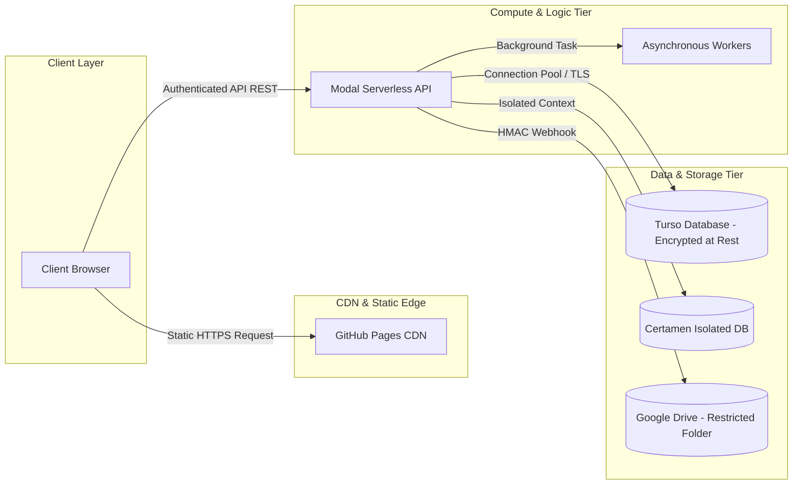
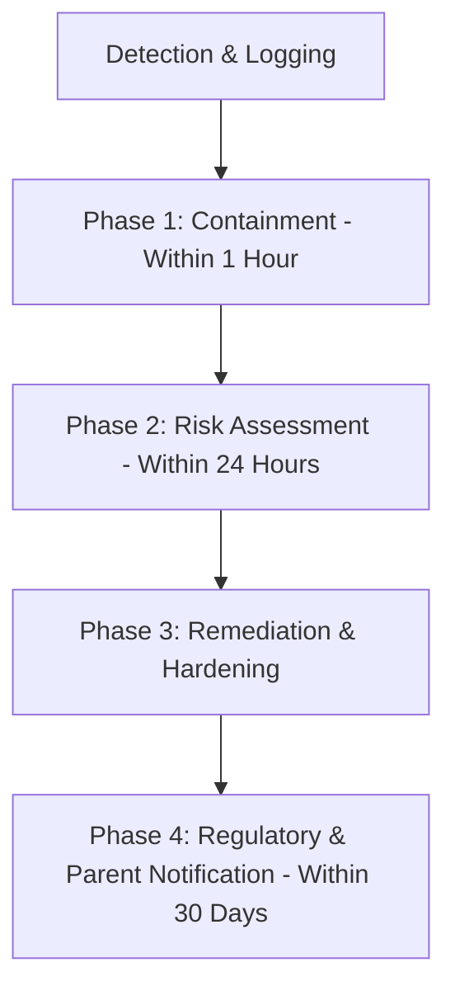

# Data Privacy, Security & Regulatory Compliance Specification

**Platform:** 72nd Annual CAJCL State Convention Platform (`state.uhsjcl.org`)  
**Operator:** California Junior Classical League (CAJCL), 501(c)(3) Non-Profit  
**Document Classification:** Regulatory & Operational Compliance Specification  
**Applicable Legal Frameworks:** COPPA (16 CFR Part 312), FERPA (34 CFR Part 99), SOPIPA (Cal. Bus. & Prof. Code § 22584), AB 1584 (Cal. Educ. Code § 49073.1), Cal. Civ. Code § 1798.81.5  

---

## 1. Executive Summary & Governance Scope

This document defines the data privacy safeguards, architectural security boundaries, and regulatory compliance posture for the CAJCL State Convention digital platform.

### Statutory Applicability Matrix

| Regulatory Framework | Jurisdiction / Entity Threshold | Platform Applicability Determination | Compliance Strategy |
| :--- | :--- | :--- | :--- |
| **COPPA** (16 CFR Part 312) | Operators collecting PII online from children under 13. Excludes 501(c)(3) entities under FTC Act §5. | **Voluntary Full Adherence:** Middle school delegates include students aged 11–12. CAJCL enforces COPPA standards as industry best practice. | Explicit parental consent on physical waivers; strict minimization; no behavioral tracking. |
| **FERPA** (34 CFR Part 99) | Educational agencies receiving federal funding. Does not apply directly to non-profit entities. | **Contractual / Sponsor Alignment:** School sponsors (district employees) supply roster data. System respects directory information boundaries. | Data strictly segregated by school; no redisclosure to commercial third parties. |
| **SOPIPA** (Cal. Bus. & Prof. Code § 22584) | Operators of sites designed, marketed, and used primarily for K–12 school purposes. No non-profit exemption. | **Mandatory Compliance:** The system directly administers interscholastic K–12 academic competition activities. | Prohibition on student profiling, targeted advertising, or data monetization; verified purge cycles. |
| **AB 1584** (Cal. Educ. Code § 49073.1) | Contracts between California LEAs (school districts) and third-party digital providers. | **Standard Addendum Availability:** Provides required statutory terms if requested by participating districts. | Standard student records addendum incorporated into School Authorization (§10). |

---

## 2. End-to-End Data Flow Architecture


```mermaid
graph LR
    subgraph Client Layer
        Browser[Client Browser]
    end

    subgraph CDN & Static Edge
        GHP[GitHub Pages CDN]
    end

    subgraph Compute & Logic Tier
        Modal[Modal Serverless API]
        Worker[Asynchronous Workers]
    end

    subgraph Data & Storage Tier
        Turso[(Turso Database - Encrypted at Rest)]
        CertDB[(Certamen Isolated DB)]
        Drive[(Google Drive - Restricted Folder)]
    end

    Browser -->|Static HTTPS Request| GHP
    Browser -->|Authenticated API REST| Modal
    Modal -->|Connection Pool / TLS| Turso
    Modal -->|Isolated Context| CertDB
    Modal -->|Background Task| Worker
    Modal -->|HMAC Webhook| Drive
```

### Data Flow Lifecycle Stages
1. **Public Browsing:** Anonymous visitors access pre-rendered HTML/CSS from GitHub Pages CDN. Public statistics (`/public/stats`) serve cached, pre-aggregated integer values without scanning identity tables.
2. **Authentication:** Attendee enters code `PPP-XXXXX-XXXXX`. Modal validates against `HMAC-SHA256(pepper, code)` in Turso. On success, a 256-bit cryptographically secure session token is issued; only its SHA-256 hash is retained.
3. **Roster Ingestion:** Chapter sponsors input student attendee rosters. Data parses in-memory with zero persistence during preview. Commits are enforced via signed idempotency keys.
3a. **Self-Registration by Join Code (preferred):** Each chapter has a join code distributed on a printed handout. A student types it with their own first and last name, grade, and Latin level; the site creates a *pending* delegate in that chapter and shows the student their login token once. The sponsor then approves the student (who joins the roster, invoice and totals) or denies them (the existing redaction runs: every personal field, session, form answer, contest entry and audit-log mention is removed, leaving an anonymous row). Until approved, the record is marked *preliminary*: it is visible to the sponsor and to registration chairs, and is excluded from billing, public statistics and caterer counts.
4. **Digital Activity Sheets:** Delegates submit test selections and meal preferences. Drafts save to local browser storage; finalized records commit to Turso under transactional audit logs.
5. **Digital Contest Uploads:** Pre-convention creative submissions (art, essays, poetry) transmit via Modal to Google Drive via an authenticated webhook puppet. Files are hashed and stored with anonymized identifiers.
5a. **At-Convention Photo Contest:** During convention, delegates may upload one photo per category the Activities chair has opened (e.g. "Best flower photo"), with an optional caption, from their own phone. The browser re-draws each photo before sending it, which removes the location, camera and time data a phone embeds; the server strips any such metadata that survives. The photo and a small thumbnail go through the same signed Apps Script puppet to the restricted contest Drive folder (`Photo Contest/<category>/`, files named by chapter and student). Only the Activities chair (scope `activities`) and Convention Presidents see photos with names; judges, sponsors and the public do not. A photo is deleted (Drive trash) when the student withdraws it, when the chair takes it down or deletes its category, or when the student is redacted/denied.
6. **Double-Blind Judging:** Evaluators access contest files anonymized as `Entry N`. Author names, school chapters, and source metadata are programmatically stripped from judging views.
7. **Physical Medical Documentation (Zero-Ingestion Boundary):** Student/Adult medical records and signed liability forms are handled exclusively on paper and uploaded as PDF scans to a private Google Drive folder accessible solely by Convention Presidents. **No health records are stored in the application database.**
8. **Post-Convention Data Purge:** Exactly 30 days post-convention (**April 12, 2027**), all identifying personal records are permanently expunged, retaining only a de-identified statistical archive.

---

## 3. Information Classification & Data Inventory

| Classification Category | Data Fields Captured | Target Subjects | Ingestion Method | Retention Period |
| :--- | :--- | :--- | :--- | :--- |
| **Directory Identification** | Full Legal Name, Academic Grade (6–12), Chapter Affiliation, Assigned Badge ID | Delegates, Adults, Sponsors | Sponsor Roster Input, or the student's own entry via the chapter join code | Purged April 12, 2027 (denied joiners: removed at once) |
| **Academic & Event Data** | Latin Level, Testing Categories, Team Competition Selections, Contest Submissions | Delegates | Digital Student Form | Purged April 12, 2027 (De-identified counts archived) |
| **Photo Contest Entries** | Photograph (may show other attendees), Optional Caption, Category, uploader's name and chapter in the Drive file name | Delegates | Student's own upload at convention; location/camera metadata removed before storage | Purged April 12, 2027 (Drive `Photo Contest` folder deleted); removed at once on withdrawal, take-down or redaction |
| **Emergency Contact** | Parent/Guardian Name, Parent/Guardian Phone Number | Delegates | Sponsor Roster Input | Purged April 12, 2027 |
| **Adult Contact Info** | Email Address, Mobile Phone, Chaperone Availability Notes | Sponsors, Chaperones | Adult Form | Purged April 12, 2027 |
| **Cryptographic Auth** | Code HMAC, Session Token SHA-256 Hash, Hashed IP, User-Agent | All Registrants | Automated / System Generated | Purged April 12, 2027 (Tokens expire in 180 days) |
| **Financial Accounting** | Check Number, Ledger Amount, Remittance Notes | Sponsoring Chapters | Administrative Entry | Retained for 501(c)(3) tax audit requirements (7 years) |

### Explicitly Excluded Data Elements (Deliberate Non-Collection)
- **Student Email Addresses:** System architecture strictly rejects delegate email addresses; all communications route through adult sponsors.
- **Home Addresses & Social Security Numbers:** Never requested or accepted.
- **Birth Dates:** Student eligibility is governed strictly by academic grade (6–12).
- **Payment Card Data:** System accepts no electronic card processing; all fees remit via physical institutional checks.
- **Digital Health Records:** Zero medical data is stored on web database infrastructure.

---

## 4. Vendor Risk Assessment & Sub-Processor Matrix

| Sub-Processor | Service Role | Security Certification | Data Protection Agreement (DPA) | Data Transferred |
| :--- | :--- | :--- | :--- | :--- |
| **GitHub, Inc.** | Static CDN (Pages), CI/CD (Actions), Source Repo | SOC 1/2/3, ISO 27001 | Executed standard enterprise DPA | Static assets, visitor IP logs, CI encrypted secrets |
| **Modal Labs, Inc.** | Serverless Compute Backend, Asynchronous Workers | SOC 2 Type II, TLS 1.3, Encrypted at Rest | Executed standard platform DPA | Ephemeral compute payloads, API execution context |
| **Turso (ChiselStrike)**| Distributed libSQL (SQLite) Relational Database | SOC 2 Type II, AES-256 Volume Encryption | Executed standard platform DPA | Primary relational data, authentication HMACs |
| **Google LLC** | Google Drive / Apps Script (Digital uploads & scans) | ISO 27001/27018, SOC 2/3 (Workspace infrastructure) | Google Cloud Data Processing Addendum (Workspace) | Contest digital files, photo contest images and thumbnails, scanned physical liability PDFs |

---

## 5. Technical & Organizational Safeguards (TOMs)

### Authentication & Access Control
- **Zero Cleartext Credentials:** Login tokens are salted and hashed using `HMAC-SHA256(CODE_PEPPER, code)`. The pepper resides exclusively in Modal Secrets.
- **Session Security:** Bearer tokens represent 256 bits of cryptographically secure pseudorandom entropy (`secrets.token_urlsafe(32)`), verified via SHA-256 hashing.
- **Brute-Force Rate Limiting:** Enforces maximum thresholds of 5 failed authentication attempts per code per hour, and 10 failed attempts per IP per 15 minutes before triggering an HTTP 429 lockout. Wrong chapter join codes are limited separately (30 per IP per 15 minutes).
- **Join Codes Are Not Credentials:** A chapter's join code is stored in plaintext so the sponsor can read it, and can only create a pending delegate in that chapter. Sponsors can close or replace it at any time.

### Network & Application Hardening
- **End-to-End Encryption:** Strict HTTPS enforcement across all endpoints with modern TLS 1.3 ciphers.
- **Security Headers:** Enforces `X-Frame-Options: DENY`, `X-Content-Type-Options: nosniff`, `Referrer-Policy: strict-origin-when-cross-origin`, and strict `Content-Security-Policy`.
- **SQL Injection Prevention:** 100% of relational queries utilize prepared, parameterized statements loaded from isolated `.sql` definitions in `backend/queries/`. Dynamic SQL formatting is forbidden and blocked in CI.
- **Cross-Site Scripting (XSS) Mitigation:** Frontend avoids `innerHTML` manipulation; all dynamic content is injected via safe DOM text node assignments.
- **Immutable Transaction Logging:** Relational mutations enforce database-level triggers requiring associated audit log generation (`audit_log`), preventing untracked administrative modifications.

---

## 6. Written Data Retention & Purge Policy

Pursuant to COPPA § 312.10 and SOPIPA § 22584(d)(2), the platform adheres to an automated data lifecycle:

```text
[Convention Operations: March 12-13, 2027]
           │
           ▼
[Tabulation & Verification Window: March 14 - April 11, 2027]
  • Score exports provided directly to chapter sponsors.
           │
           ▼
[Mandatory Complete Purge Date: April 12, 2027]
  • All identifying student data deleted from production databases.
  • Scanned medical and waiver PDF files deleted from Google Drive.
  • Contest entry files and the Photo Contest folder deleted from Google Drive.
  • Ephemeral container logs and exports destroyed.
           │
           ▼
[Permanent Historical Archive (De-Identified)]
  • Preserves strictly: Year, Badge Number, Chapter, Grade, Latin Level, Competition Placements.
  • Zero student names, zero phone numbers, zero contact records.
```

---

## 8. Incident Response & Breach Notification Protocol

In accordance with California Civil Code § 1798.82:


```mermaid
graph TD
    T0[Detection & Logging] --> T1[Phase 1: Containment - Within 1 Hour]
    T1 --> T2[Phase 2: Risk Assessment - Within 24 Hours]
    T2 --> T3[Phase 3: Remediation & Hardening]
    T3 --> T4[Phase 4: Regulatory & Parent Notification - Within 30 Days]
```

1. **Phase 1: Containment (Within 1 Hour)**
   - Invalidate compromised login tokens or session tokens via administrative revocation.
   - If server credentials or the `CODE_PEPPER` are exposed, immediately rotate secrets via `modal secret create ... --force`.
2. **Phase 2: Forensic Impact Assessment (Within 24 Hours)**
   - Audit immutable `audit_log` records to identify exact records viewed or exfiltrated.
   - Segment exposure between directory data (names) and highly sensitive records (PINs, medical files).
3. **Phase 3: Remediation & Isolation**
   - Patch discovered vulnerability; deploy verified hotfix via automated CI/CD pipeline.
4. **Phase 4: Legal & Institutional Notification**
   - If personal identifying information is confirmed exfiltrated, CAJCL will notify affected school district sponsors and parents in writing without unreasonable delay, not to exceed statutory 30-day thresholds.

---

## 9. Public Privacy Notice (Students & Parents)

*This notice is displayed prominently on `state.uhsjcl.org` and linked on all registration entry screens:*

> ### CAJCL State Convention Privacy Notice
> **Effective Date:** October 1, 2026  
> **Entity:** California Junior Classical League (CAJCL), 501(c)(3)  
> 
> **Summary for Families & Students:**  
> CAJCL collects limited student information solely to coordinate registration, competition scheduling, academic test grading, and emergency safety at the 72nd Annual CAJCL State Convention.
> 
> - **Information We Collect:** Student legal name, grade level, Latin course level, competition selections, meal preference, and parent/guardian emergency contact numbers (collected through your school Latin teacher/sponsor). A student may also enter their own name, grade, and Latin level when joining their chapter with the join code on the handout their teacher gave them; if the teacher does not approve that registration, everything entered is deleted.
> - **Convention Photo Contest (optional):** Students may upload photos they take at convention, with a caption, for fun categories. Location data is removed from each photo before it is stored. Photos are seen only by the Activities chair and Convention Presidents, and are deleted with everything else on April 12, 2027, or sooner on request.
> - **Information We Never Collect:** We never ask for or store student email addresses, home street addresses, dates of birth, or credit card numbers.
> - **Zero Commercial Use:** We never sell student data, never display commercial advertisements, and never build marketing profiles.
> - **Data Deletion:** All identifying student records are permanently purged 30 days after convention (**April 12, 2027**).
> - **Parental Rights:** Parents and legal guardians retain the right to review, correct, or request deletion of their child’s personal information at any time by contacting: `state@uhsjcl.org`.

---

## 10. School Authorization Addendum (California AB 1584 / FERPA)

When educational agencies participate in the CAJCL State Convention, CAJCL guarantees adherence to Cal. Educ. Code § 49073.1:
1. **Ownership:** Pupil records provided to CAJCL remain the property of and under the control of the participating educational agency.
2. **Access & Correction:** Parents, legal guardians, and eligible pupils may review and correct personally identifiable information through their chapter sponsor or direct notice to CAJCL.
3. **Unauthorized Use:** CAJCL shall not use any pupil information for purposes beyond those specified in convention registration and academic competition administration.
4. **Prohibition on Commercial Advertising:** Targeted advertising, profiling, or monetization of student records is strictly prohibited.
5. **Data Security & Retention:** CAJCL implements the technical safeguards described in §5 and executes scheduled deletion pursuant to §6 upon completion of the convention cycle.

---

## 11. Regulatory Compliance Mapping

| Statutory Requirement | Legal Source | Platform Implementation | Verification Status |
| :--- | :--- | :--- | :--- |
| **Notice & Verifiable Consent** | COPPA § 312.4, § 312.5 | Sponsor-pasted rosters: physical signed parent waiver is collected before portal credentials are handed out. **Join-code registration reverses that order for the first entry:** the student types their own name, grade and Latin level (no email, no contact details) on the sponsor's handout *before* a parent has signed the waiver that is in the same packet. The record is pending and invisible to the public, to billing and to judges until the sponsor, acting as the school official, approves it; denial deletes it. | **Needs confirmation** (see §12) |
| **Data Minimization** | COPPA § 312.7 | Zero student emails, zero financial data; optional fields strictly isolated. | **Compliant** |
| **Reasonable Security Program** | COPPA § 312.8, Civ. Code § 1798.81.5 | Formal WISP established (§7); TLS 1.3 encryption; SOC 2 Type II vendors; salted HMACs. | **Compliant** |
| **Retention & Timely Purge** | COPPA § 312.10, SOPIPA § 22584(d)(2) | Documented automated purge cycle executed on April 12, 2027. | **Compliant** |
| **Ban on Commercial Profiling** | SOPIPA § 22584(b) | Platform carries no advertisements, behavioral tracking pixels, or commercial integrations. | **Compliant** |
| **Third-Party Contract Guarantees** | SOPIPA § 22584(b)(4)(E), AB 1584 | All sub-processors bound by formal Data Protection Agreements. | **Compliant** |

---

## 12. Governance Action Plan & Remediation Milestones

| Target Milestone | Governance Action Required | Assigned Stakeholder | Target Date |
| :--- | :--- | :--- | :--- |
| **Google Workspace Migration** | Transition Drive puppet and medical upload destination from personal Gmail to official `cajcl.org` Google Workspace for Education account. | Technology Commissioners | Prior to Sponsor Launch |
| **Under-13 Join-Code Self-Entry** | Decide whether COPPA's school-authorization route (the sponsor acts as the school's agent and approves each joiner) is sufficient for middle-school students typing their own name, grade and Latin level before the parent waiver is signed, or whether joining must be limited to high-school chapters / gated on the signed waiver. Record the decision here and in the school authorization form (§10). | CAJCL Board of Directors | Prior to Sponsor Launch |
| **Photo Contest: Other People in Photos** | Decide whether photo contest categories may include photos of other identifiable attendees (most are minors), or should be limited to objects, places and the photographer's own group. Today the upload page asks students to get permission before photographing anyone, and the Activities chair can take any photo down at once. Also decide whether winning photos may be shown publicly (e.g. at the awards assembly), which would need the photographer's and any pictured person's consent. | CAJCL Board of Directors | Prior to Convention |
| **Privacy Officer Designation** | Formally name adult compliance coordinator and publish contact information across all legal notices. | CAJCL Board of Directors | Prior to Sponsor Launch |
| **Automated Purge Tooling** | Deploy automated script `scripts/purge_convention_data.py` to execute zero-downtime deletion on April 12, 2027. | Backend Engineering | December 2026 |
| **Certamen PIN Security Hardening**| Implement Argon2id or bcrypt hashing on Certamen practice arena PINs to align with primary authentication standards. | Backend Engineering | Prior to Public Launch |
