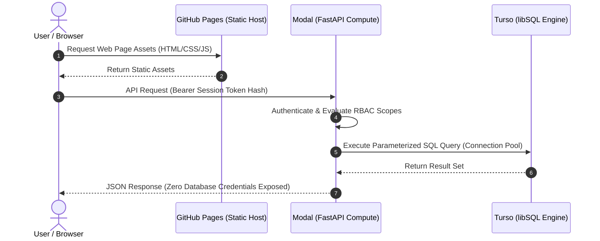

# Platform Operations & Incident Management Runbook

**System:** 72nd Annual CAJCL State Convention Digital Platform  
**Target Environment:** Production (`state.uhsjcl.org`)  
**Audience:** Technology Commissioners, Systems Administrators, Operations Leads  

---

## 1. System Architecture & Data Flow

The platform utilizes a decoupled, serverless architecture where public clients interact with compute and database tiers through strictly authenticated interfaces.



### Security Boundary
- The browser **never** connects directly to the database and contains no database credentials.
- All business logic, transaction scopes, and authorization policies execute within Modal.

---

## 2. Repository Layout & Topology

```text
├── frontend/public/          # Static distribution root (HTML5, Vanilla ES6, CSS Tokens)
│   ├── index.html            # Single-page application shell
│   ├── tokens.css            # Global design tokens (color palette, typography, spacing)
│   ├── app.css               # Core component styling & layouts
│   ├── js/                   # Modular client-side controllers
│   │   ├── main.js           # Client router, session controller, auth dispatcher
│   │   ├── api.js            # Fetch wrapper, error interceptors, cold-start polling
│   │   └── pages/            # Page-specific DOM controllers (roster, invoice, etc.)
│   └── fonts/                # Self-hosted typography assets (Literata, Plex)
├── backend/                  # Serverless application tier
│   ├── api.py                # FastAPI route declarations & CORS security policy
│   ├── app.py                # Modal container images, function declarations, schedules
│   ├── lib/                  # Isolated domain logic (auth, codes, roster, stats)
│   ├── queries/              # Immutable, parameterized SQL statements (.sql files)
│   ├── migrations/           # Forward-only schema version control
│   └── workers/              # Heavy asynchronous jobs (WeasyPrint PDF, bulk exports)
├── scripts/                  # Administrative operations & continuous validation CLI
└── docs/                     # Product, security, architecture, and regulatory specs
```

---

## 3. Local Development & Automated Testing

### Environment Initialization
```bash
# Activate environment
source .venv/bin/activate  # Windows: .venv\Scripts\Activate.ps1

# Terminal 1: Local Backend API Service
export CODE_PEPPER="local-development-pepper-string"
python scripts/seed.py --db dev.db --reset
uvicorn backend.api:app --reload --port 8000

# Terminal 2: Static Asset Server
python -m http.server 8080 --directory frontend/public
```
Navigate to: `http://localhost:8080` (point `frontend/public/config.js` to `http://localhost:8000`).

### Automated Test Suite Execution
```bash
# Execute unit and integration tests (approx. 420 checks)
pytest backend/tests -q

# Validate that no queries trigger unindexed table scans
python scripts/check_query_plans.py
```

### Architecture Note on ARM64 Platforms (Apple Silicon vs Snapdragon/ARM Windows)
- Hosted `libsql` pre-built wheels exist for macOS ARM64 and Linux/Windows x86_64.
- If running on ARM Windows without native wheels, run database tasks through Modal:
  `modal run backend/app.py::setup` (runs remotely on x86_64 containers).

---

## 4. Configuration Management & Change Governance

### Change Classification Matrix

| Change Scope | Target Configuration Point | Requires Code Deploy? |
| :--- | :--- | :--- |
| **Convention Parameters** (Dates, Venue, Fees, Theme) | **Settings → Values** (Web Portal) | No (Immediate) |
| **Display / Printed Copy** | **Settings → Printed Wording** | No (Immediate) |
| **System Banner Alerts** | **Settings → Announcements** | No (Immediate) |
| **User Role Assignments** | **Settings → Roles** | No (Immediate) |
| **Container Warm Schedule** | **Settings → Operations** | No (Immediate) |
| **Design / Stylesheet Tokens** | `frontend/public/tokens.css` | Yes (Git Push) |
| **API Logic & Endpoints** | `backend/lib/` or `backend/api.py` | Yes (Git Push / Modal Deploy) |
| **Schema & Database Migrations**| `backend/migrations/` | Yes (Controlled Pipeline) |

### Migration Integrity & Forward-Only Rule
Migrations are strictly immutable. **Never edit an applied migration.**
1. Changing an existing migration invalidates `backend/migrations/CHECKSUMS.txt` and crashes deployment on hash mismatch.
2. To apply a structural change:
   - Create a new migration file: `backend/migrations/01X_descriptive_name.sql`.
   - Update checksums: `python scripts/checksum_migrations.py`.
   - Commit both the migration and `CHECKSUMS.txt`.

---

## 5. Deployment & Release Pipeline

### Continuous Deployment (GitOps)
Pushing to `main` triggers `.github/workflows/deploy.yml`:
1. Executes automated test suite (`pytest`).
2. Validates migration checksum integrity.
3. Deploys updated containers to Modal.
4. Executes forward migrations against production Turso.
5. Builds fonts and dynamic snapshots.
6. Deploys static distribution to GitHub Pages.

### Manual Backend Deployment
```bash
modal deploy backend/app.py
```

---

## 6. Cryptographic Secrets & Environment Configuration

Secrets reside exclusively in **Modal Secrets** (`cajcl-2027`) and **GitHub Actions Secrets**:

| Secret Key | Description | Critical Operational Impact |
| :--- | :--- | :--- |
| `CODE_PEPPER` | Cryptographic HMAC pepper for access codes. | **FATAL IF CHANGED:** Invalidates all existing access codes system-wide. Requires full credential reissuance. |
| `TURSO_DATABASE_URL` | TLS endpoint for libSQL database. | Direct database connectivity failure if incorrect. |
| `TURSO_AUTH_TOKEN` | Bearer token for database read/write. | Authentication failure to database layer. |
| `MODAL_TOKEN_ID` / `_SECRET`| CI/CD deployment credentials. | GitHub Actions deployment failure. |
| `APPS_SCRIPT_URL` / `_KEY` | Drive puppet webhook integration. | Contest digital upload pipeline failure. |
| `DB_POOL` | Connection pooling toggle (`1` by default). | If set to `0`, increases query latency significantly. |

*Rotating Secrets Safely:* `modal secret create cajcl-2027 KEY="value" ... --force` (Must pass all existing keys; `--force` replaces the entire bundle).

---

## 7. Performance Optimization & Infrastructure Warming

### Container Warm Management
Modal spins down inactive compute instances to conserve resources. During high-priority windows:
1. Navigate to **Settings → Operations → Keep Warm**.
2. Select **Keep warm for 6 hours**.
3. *System Design:* A database-backed scheduled reconciler polls every 5 minutes to maintain instance warmth across rolling redeployments.

### Connection Reuse Monitoring
- Modal FastAPI endpoints maintain a thread-local libSQL connection pool, eliminating per-request TLS handshake overhead (~350ms).
- Verify connection metrics under **Settings → Operations → Connections**.

---

## 8. Backup, Export & Disaster Recovery SOP

### Data Export Procedures
From **Settings → Operations → Export** or via CLI:
```bash
python backend/workers/export.py --db cajcl.db --out ./exports
```
Generates 4 discrete artifacts:
1. `cajcl-YYYYMMDD-HHMM-full.xlsx` (Complete human-readable workbook)
2. `cajcl-YYYYMMDD-HHMM-full.sql` (Raw database SQL dump)
3. `cajcl-YYYYMMDD-HHMM-anonymized.xlsx` (PII-stripped analytical workbook)
4. `cajcl-YYYYMMDD-HHMM-anonymized.sql` (PII-stripped database dump)

*Data Privacy Constraint:* Anonymized exports remain **pseudonymous** (attendee sequence numbers correlate with printed badges). Distribute only under strict non-disclosure. All local exports must be purged post-convention by **April 12, 2027**.

### Database Restoration SOP
To restore from an SQL dump into a new database:
```bash
sqlite3 restored.db < exports/cajcl-YYYYMMDD-HHMM-full.sql
```

---

## 9. Role-Based Access Control (RBAC) Governance

Roles bundle functional permission scopes. Scopes are never assigned to individuals directly.

| Scope Identifier | Permitted Operations | Bound Context |
| :--- | :--- | :--- |
| `*` (Superadmin) | System configuration, audit logs, raw exports, viewing-as | Global |
| `registration` | Roster mutations, chapter profiles, payments, Friday check-in | Global |
| `academics` | Activity catalogs, competition scoring, test administration | Global |
| `awards` | Score tabulation, awards calculation, ceremony exports | Global |
| `sponsor` | Roster ingestion, credential generation, activity verification | Strictly scoped to own chapter |
| `delegate` | Digital activity sheet submission, schedule review | Strictly scoped to self |
| `chapter` | Team athletics registrations, publicity portfolio submission | Strictly scoped to own chapter |
| `judge` | Pre-convention submission judging | Blind contest evaluation |

*Multi-Chapter Sponsor Association:*  
If a single teacher manages multiple institutions (e.g., MS and HS delegations), navigate to **Chapters → Select Second Chapter → Use Existing Sponsor**. Adds access scope without duplicating attendee records or access codes.

---

## 10. Quota Monitoring & Capacity Planning

Current consumption vs. Turso Free Tier thresholds:

| Metric | Monthly Quota | Expected Peak Load | Safety Margin |
| :--- | :--- | :--- | :--- |
| **Storage** | 5.0 GB | ~25.0 MB | 200× Headroom |
| **Row Reads** | 500,000,000 | ~15,000,000 | >30× Headroom |
| **Row Writes** | 10,000,000 | ~150,000 | >60× Headroom |

*Quota Exhaustion Defense:*  
Exceeding row read quotas triggers a hard database block. To prevent runaway scans:
- All database queries are centrally maintained in `backend/queries/`.
- CI runs `EXPLAIN QUERY PLAN` validation on all SQL queries before merge.
- The public welcome page serves cached pre-baked statistics snapshots (`build_snapshot.py`), neutralizing DDoS row consumption.

---

## 11. Incident Response & Troubleshooting Playbooks

| Incident Condition | Diagnostic Pathway | Remediation Protocol |
| :--- | :--- | :--- |
| **Service Unresponsive (504 / Gateway Timeout)** | Modal container is suspended or crashed. | 1. Check Modal dashboard logs.<br>2. Execute `modal deploy backend/app.py`.<br>3. Engage **Keep Warm** for 6 hours. |
| **Database Connection Failure** | Network TLS or token authentication error. | 1. Run `modal run backend/app.py::doctor`.<br>2. If status is `BLOCKED`, quota has been exceeded.<br>3. If handshake fails, regenerate `TURSO_AUTH_TOKEN`. |
| **`InvalidHeaderValue` Error** | Unintended newline character embedded in token string. | Re-export `TURSO_AUTH_TOKEN` ensuring strict single-line formatting (`tr -d '\n'`). Re-create Modal secret with `--force`. |
| **`WSServerHandshakeError: 400`** | Deprecated `libsql-client` package installed. | Run `pip uninstall libsql-client && pip install libsql`. |
| **Missing Timezone Database on Windows** | `ZoneInfoNotFoundError: America/Los_Angeles`. | Windows lacks native Olson timezone data. Run `pip install tzdata`. |
| **GitHub Pages 404 Error** | Workflow execution failed or custom DNS misconfigured. | 1. Review GitHub Actions workflow status.<br>2. Ensure repository secrets (`MODAL_TOKEN_ID`, etc.) are configured.<br>3. Verify `frontend/CNAME` matches DNS records. |
| **Global Authentication Failure** | Access codes rejected system-wide. | Verify `CODE_PEPPER` in Modal Secrets matches the deployment key. |
| **Venue Connectivity Outage** | Internet failure at convention site. | Launch local standalone instance (`uvicorn backend.api:app --port 8000` + static file server). All local SQLite features function offline. |
| **Emergency Notice Requirement** | Need to broadcast critical alert while backend is down. | Edit `frontend/public/announcement.json` directly via GitHub web UI (`"active": true`). Displays across the static shell within 60 seconds without backend dependencies. |

---

## 12. Non-Negotiable Architectural Invariants

1. **Deterministic Time Handling:** All system deadlines represent 11:59:59 PM Pacific Time (`America/Los_Angeles`). Stored internally in ISO-8601 UTC.
2. **Immutable Financial Ledger:** Payment entries cannot be edited or deleted. Discrepancies are resolved solely via offsetting credit/debit records.
3. **Data Immutability & Audit Trail:** Deletion is strictly implemented as a soft status flag (`status = 'cancelled'`). Audit trails in `audit_log` cannot be altered or truncated.
4. **Strict No-Refund Accounting:** Attendees cancelled post-payment maintain a `cancelled_paid` state to ensure invoice reconciliation matches bank receipts.
5. **PII Minimization:** The system never collects or stores student email addresses or direct medical histories.
