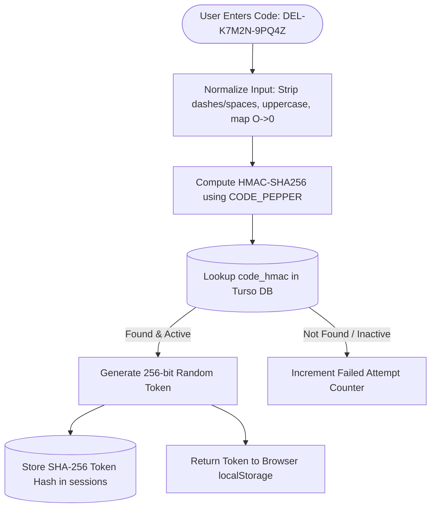

# Information Security Architecture & Threat Model

**Platform:** 72nd Annual CAJCL State Convention Platform (`state.uhsjcl.org`)  
**Document Classification:** Technical Security Architecture & Threat Assessment  
**Audience:** Security Auditors, Technology Commissioners, System Architects  

---

## 1. Executive Summary & Security Principles

The CAJCL convention platform security model is built on four core architectural principles:
1. **Zero Cleartext Credentials:** The system stores zero plaintext passwords, access codes, or session tokens.
2. **Strict Data Minimization:** High-risk elements (student emails, home addresses, dates of birth, payment cards, medical files) are never ingested into the digital database.
3. **Role-Based Isolation (RBAC):** Every API endpoint enforces declarative permission scopes and strict institutional tenancy boundaries.
4. **Automated Continuous Assurance:** Automated test suites validate that every API route enforces authentication and tenancy isolation before code merges.

---

## 2. Authentication & Credential Architecture



### Access Code Cryptographic Design
- **Credential Format:** `PPP-XXXXX-XXXXX` (3-character role prefix + 9 Crockford Base32 characters + 1 modulo checksum symbol).
- **Entropy:** $9 \times \log_2(31) \approx 44.6\text{ bits}$ ($\approx 2.6 \times 10^{13}$ unique combinations).
- **Storage Protection:** Stored strictly as `HMAC-SHA256(CODE_PEPPER, normalized_code)`. The `CODE_PEPPER` resides exclusively in Modal Secrets and is never exposed to client applications or the database engine.
- **Session Tokens:** 256 bits of cryptographically secure randomness generated via `secrets.token_urlsafe(32)`. The database retains only the SHA-256 hash.

### Brute-Force Rate Limiting

| Protective Boundary | Threshold Limit | System Action | Threat Mitigated |
| :--- | :--- | :--- | :--- |
| **Per-Code Bucket** | 5 incorrect attempts per hour | Target access code temporarily disabled for 60 minutes. | Targeted guessing against a specific student or sponsor code. |
| **Per-IP Address Bucket** | 10 incorrect attempts per 15 minutes | Source IP locked out from authentication endpoints. | Automated distributed credential-stuffing sweeps. |

| **Join-Code Failures (per IP)** | 30 incorrect join codes per 15 minutes | Source IP refused further join attempts. | Walking the 8-character join-code space. Counted apart from sign-in failures (stored with a leading `j`), so a classroom typing one printed code cannot lock anyone out of signing in. |

*Join codes:* a chapter's 8-character join code (about 39 bits) is stored as plaintext, is printed on every handout, and is *not* a bearer credential: it can only create a **pending** delegate in that chapter, a sponsor can close or replace it at any moment, and a chapter accepts at most 150 pending students.

*Cryptographic Feasibility:* At the enforced rate limit of 960 attempts/day per IP, exhaustive search of 44.6 bits requires over 70 million years of continuous computation.

---

## 3. Authorization & Tenancy Isolation (RBAC)

The platform enforces strict role-based access control across all 86 API routes:

```text
person_roles  ──>  roles  ──>  role_scopes  ──>  [Route Guard Evaluation]
```

- **Declarative Route Guards:** Every backend endpoint declares its mandatory permission scope. Unit tests (`test_endpoints.py`) exhaustively query every route with unauthenticated tokens, invalid scopes, and cross-chapter credentials; unannotated routes fail CI automatically.
- **Tenancy Boundary Enforcement:** 
  - `sponsor`, `delegate`, and `chapter` scopes are strictly constrained by the caller's assigned `school_id`. Cross-chapter data access is rejected with HTTP 403 Forbidden.
  - Administrative scopes (`registration`, `academics`, `awards`, `*`) are restricted to verified Convention Board members.
  - `judge` scope permits evaluation of contest submissions blinded as `Entry N`. Author names, school affiliations, and source filenames are programmatically stripped. Users holding `academics` scope are barred from holding `judge` roles to prevent bias.

---

## 4. Cryptographic Implementation & Storage Security

### Encryption Standards
- **In-Transit:** Mandatory TLS 1.3 across all communication links (Browser ↔ CDN, Browser ↔ Modal API, Modal ↔ Turso Engine). Client-side credentials are never transmitted over unencrypted protocols.
- **At-Rest:** Turso database storage volumes are encrypted using AES-256.
- **Network Telemetry Anonymization:** Client IP addresses logged for security auditing are transformed via `HMAC-SHA256(CODE_PEPPER, ip_address)` to prevent bulk reverse-mapping of IPv4 addresses.

### Deliberate Architectural Boundary: Unencrypted Directory Data
- Database volume encryption protects data at rest against physical storage theft.
- However, application-level column encryption is deliberately omitted for attendee names and emergency contact details to maintain high-performance SQL indexing, sorting, and reporting. Security relies on API route authorization, secret isolation, and access code hashing.

---

## 5. Application Hardening & Vulnerability Mitigation

| Attack Vector | Defense Mechanism | Implementation Details |
| :--- | :--- | :--- |
| **SQL Injection (SQLi)** | 100% Parameterized Statements | Queries are stored in isolated `.sql` files (`backend/queries/`). CI tests reject dynamic string formatting or concatenations. |
| **Cross-Site Scripting (XSS)** | Text-Node DOM Injection & CSP | Client-side JavaScript injects dynamic values exclusively via safe text nodes (`document.createTextNode`). HTML meta tag enforces strict Content Security Policy. |
| **Clickjacking / Framing** | HTTP Security Headers | API emits `X-Frame-Options: DENY`, `X-Content-Type-Options: nosniff`, and `frame-ancestors 'none'`. |
| **Resource Exhaustion (DoS)** | Strict Content Caps | Non-upload API requests enforce a 1 MB body-size limit. Creative contest file uploads enforce a strict 20 MB cap with MIME-type verification. |
| **Tampering & Audit Gaps** | Database Audit Triggers | Database mutations require an accompanying insert into `audit_log`. Administrative updates and payments are strictly append-only. |

---

## 6. Threat Modeling & Failure Mode Analysis

| Threat Scenario | Exploitation Vector | Blast Radius | Automated Mitigation / Recovery |
| :--- | :--- | :--- | :--- |
| **Leaked Join Code** | Handout photographed or posted publicly. | Spam *pending* accounts in one chapter (never billed, counted or shown publicly; capped at 150). | Sponsor closes joining or replaces the code; denies spam entries (full redaction). |
| **Misplaced Physical Packet** | Paper sheet left in classroom or photographed. | Exposure of 1 chapter roster (~30 delegate names). | Sponsor or admin clicks **Reissue Code**; voids former code and terminates active sessions immediately. |
| **Administrative Credential Leak** | Board access code exposed. | State-wide roster and reporting access. | System admin revokes compromised board role; regenerates access code; audits transaction log for unauthorized actions. |
| **Shared Terminal Session Abandonment** | User forgets to sign out on a shared Chromebook. | Unauthorized access via active session. | Global sign-out control revokes session token server-side; account dashboard permits selective remote revocation. |
| **Turso Database Token Exfiltration** | Database connection string compromised. | Relational database compromised; access codes remain protected by HMAC. | Immediately rotate `TURSO_AUTH_TOKEN` in Turso and update Modal Secret bundle. |
| **Modal Secrets Exfiltration** | Complete secret bundle exposed (`CODE_PEPPER` + DB tokens). | Database access plus ability to brute-force access codes. | Critical incident: Regenerate pepper, rebuild database credentials, batch-reissue all convention credentials system-wide. |

---

## 7. Security Audit Findings & Hardening Status

### Remediated Security Enhancements
- **Salted IP Telemetry:** Replaced plain SHA-256 IP hashing with keyed HMAC-SHA256, mitigating pre-computed rainbow table attacks against IPv4 spaces.
- **Hardened HTTP Headers:** Emitted comprehensive security headers across all API responses, preventing iframe injection and MIME-sniffing exploits.
- **CSP Meta Enforcement:** Introduced strict Content Security Policy meta directives across the static application shell.

### Open Security Roadmap Items
1. **Session Longevity Reduction:** Current sessions persist for 180 days. A planned reduction to 72 hours for administrative accounts is scheduled alongside two-factor deployment.
2. **Two-Factor Authentication (2FA) for Administrative Roles:** Integration of email-based one-time passcodes (OTP) for all accounts possessing `admin`, `registration`, `academics`, or `awards` scopes prior to public sponsor distribution.

---

## 8. Certamen Practice Arena Security Gap Analysis

The Certamen practice arena (`certamen-bot/`, `/certamen/*` endpoints) operates as an auxiliary service with a separate security baseline:

| Identified Vulnerability | Root Cause Analysis | Remediation Milestone |
| :--- | :--- | :--- |
| **Insecure Profile Override** | `POST /certamen/sync-user` updates user profiles without verifying existing PIN credentials. | Require current PIN validation before profile updates. |
| **Plaintext PIN Storage** | PIN values are stored unhashed in the auxiliary database. | Implement Argon2id / HMAC-SHA256 PIN hashing; remove PIN reflection from API responses. |
| **Unauthenticated Question Erasure** | `POST /certamen/questions/batch` with `replace=true` executes unauthenticated table truncation. | Restrict question management endpoints to verified `academics` or `*` scopes. |
| **Audit Logging Exemption** | Certamen database transactions bypass standard `Tx` auditing logic. | Route Certamen state mutations through standard transactional logging. |
