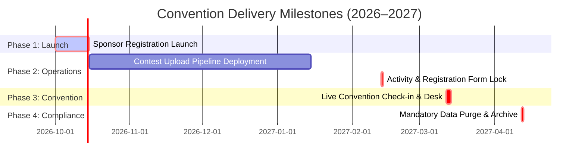

# Product Roadmap, Delivery Tracker & Milestone Governance

**Platform:** 72nd Annual CAJCL State Convention Platform (`state.uhsjcl.org`)  
**Target Release:** March 12–13, 2027  
**Document Classification:** Product Delivery & Milestone Management  

---

## 1. Executive Roadmap & Milestone Schedule

---

## 2. Work Breakdown Structure (WBS) & Delivery Tracker

### Milestone 1: Pre-Registration Launch (Critical Path)
*Target: System open to ~50 school chapters for roster entry.*

| Work Item | Domain | Est. Hours | Lead | Dependencies / Blockers | Description & Implementation Notes |
| :--- | :--- | :--- | :--- | :--- | :--- |
| **Two-Factor Authentication (2FA)** | Security | 8 | Eng | `cajcl.org` Workspace Account | Implement email OTP authentication via Apps Script for adult and administrative roles. |
| **Launch Email Broadcast** | Operations | 1 | PM | Verification of Fees/Dates | Transmit launch notification template (`docs/REGISTRATION.md`) to verified chapter sponsors. |
| **WeasyPrint Remote Smoke Test** | Workers | 0.5 | Eng | Modal Deployment | Execute one remote PDF generation run on Modal Debian worker container to confirm Pango/Cairo rendering. |
| **Chapter & Sponsor Seeding** | Data | 2 | Ops | Official CAJCL Roster | Ingest 50 verified chapter institutions and primary sponsor profiles via `board.json` or dashboard. |
| **Roster Ingestion Sanitization** | Privacy | 2 | Eng | None | Strip discarded email and phone strings from raw pasted roster text before persisting to `roster_imports`. |
| **Join-Code Launch Check** | Product | 1 | Ops | Deployed migration 011 | Confirm each live chapter has a join code (Chapters → Join code), add it to the launch email, and decide the under-13 self-entry question in `docs/PRIVACY.md` §12 before sponsors print join sheets. Edit the printed prose in Settings → Printed wording (`join_instructions`). |
| **Certamen Practice Hardening** | Security | 3 | Eng | Decision on Arena Lifespan | Hash user PINs, enforce rate limits on login, and restrict question batch-deletion endpoints. |

---

### Milestone 2: Pre-Convention Operations (Deadline: February 13, 2027)
*Target: Active student activity sheet submissions and creative contest entries.*

| Work Item | Domain | Est. Hours | Lead | Dependencies / Blockers | Description & Implementation Notes |
| :--- | :--- | :--- | :--- | :--- | :--- |
| **Drive Upload Puppet Deployment** | Backend | 2 | Eng | Google Workspace Root Folder | Deploy `apps-script/Code.gs` to host Google Drive folder; configure `APPS_SCRIPT_URL` in Modal Secrets. |
| **Contest Award Tiers Config** | Product | 1 | Ops | Academics Chair Input | Configure awarded placement counts ($N$) per competition category in dashboard. |
| **Role-Based Judge Scoping** | Auth | 3 | Eng | Contest Division Rules | Bind `judge` scopes to specific contest categories to prevent cross-contest ballot evaluation. |
| **Quota Pre-Flight Audit** | DevOps | 0.5 | Eng | None | Audit Turso row read metrics 30 days prior to event to confirm usage remains within free allowances. |

---

### Milestone 3: Convention Weekend Operations (March 12–13, 2027)
*Target: On-site check-in, walk-on handling, scoring, and awards tabulation.*

| Work Item | Domain | Est. Hours | Lead | Dependencies / Blockers | Description & Implementation Notes |
| :--- | :--- | :--- | :--- | :--- | :--- |
| **Written Tabulation Specifications**| Product | — | Board | Awards Chair Specification | Formulate written rules for sweepstakes point tabulation, chapter aggregate scoring, and tie-breakers. |
| **Offline Scoring Entry Tooling** | Frontend | 12 | Eng | Tabulation Rules | Deliver offline-capable scoring entry interface for athletic and academic competitions. |
| **Printable Badge & Certificate Gen**| Workers | 4 | Eng | Badge Stock Specifications | Deploy batch PDF rendering templates for attendee badge inserts and formal award certificates. |

---

### Milestone 4: Compliance Sunset & Data Decommissioning (April 12, 2027)
*Target: Complete purge of personally identifiable records exactly 30 days post-convention.*

| Work Item | Domain | Est. Hours | Lead | Dependencies / Blockers | Description & Implementation Notes |
| :--- | :--- | :--- | :--- | :--- | :--- |
| **Automated Data Purge Pipeline** | Compliance | 3 | Eng | Automated Export Validation | Execute `scripts/purge_convention_data.py`. Expunge student PII, medical PDF scans, and temporary exports. |
| **De-Identified Archive Extraction**| Data | 2 | Eng | Post-Event Verification | Export permanent historical competition archive: Badge ID, Chapter, Grade, Latin Level, Placements. |
| **Sponsor Results Distribution** | Operations | 2 | Ops | Tabulation Finalization | Distribute individual school placement spreadsheets directly to chapter sponsors. |

---

## 3. Product Boundaries & Scope Exclusions

The following features have been evaluated and deliberately excluded from the current product scope:

| Feature / Request | Determination | Architectural Rationale |
| :--- | :--- | :--- |
| **Interactive Campus Navigation** | **Out of Scope** | High maintenance cost; physical event maps and signage satisfy attendee wayfinding. |
| **Push Notification Schedules** | **Out of Scope** | Delegate privacy rules prohibit student contact information; delegates utilize printed schedules. |
| **Reversible Credential Encryption**| **Rejected** | Storing reversible access codes compromises security posture; selective reissuance addresses lost credentials safely. |
| **Inter-Chapter Student Transfers** | **Rejected** | Cross-school transfers violate institutional billing and Latin level eligibility constraints; drop-and-readd is required. |
| **Automated Financial Refunds** | **Rejected** | Convention budget operates on firm pre-payment terms; accounting reconciles via `cancelled_paid` state. |

---

## 4. Key Stakeholder Decisions Required

1. **Google Workspace Account Provisioning:** Appoint official CAJCL Google Workspace for Education account (`conventionpresidents@cajcl.org`) to unblock 2FA and Drive integrations.
2. **Written Tabulation Model:** Obtain formal point weighting and sweepstakes rules from Awards and Academics Chairs.
3. **Privacy Coordinator Appointment:** Appoint designated adult compliance officer to finalize statutory privacy filings.
4. **Offline Scoring Workflow:** Align on whether athletic scoring is recorded on paper and back-entered or input directly via offline laptops.

---

## 5. Architectural Invariants (Protected Patterns)

The following core patterns are tested and must not be refactored without executive review:
- **Idempotent Roster Submissions:** Roster commits require signed tokens binding payload hash and target roster fingerprint.
- **Transactional Counter Aggregates:** Statistical metrics and invoices update within mutation transactions; live full-table scans are forbidden.
- **Thread-Local Connection Pooling:** Database connection handles are pooled strictly per-thread with automatic disposal hooks, preventing cross-thread SQLite panics.
- **Strict Role-Based Scope Assignment:** Permissions bind exclusively to roles; no permissions may be assigned directly to user records.
