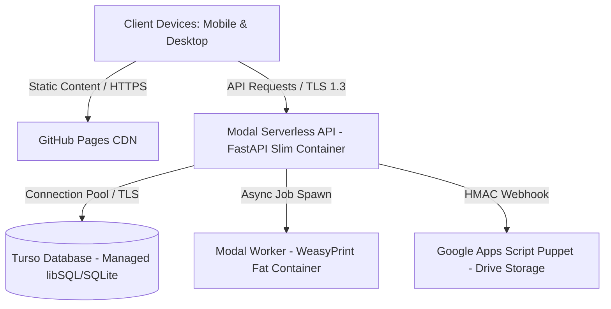

# Technology Architecture & Infrastructure Blueprint

**Platform:** 72nd Annual CAJCL State Convention Platform (`state.uhsjcl.org`)  
**Document Classification:** System Architecture & Infrastructure Engineering Specification  
**Audience:** Systems Architects, Engineering Leads, Technology Commissioners  

---

## 1. System Topology & Architectural Philosophy

The CAJCL platform implements a decoupled, serverless JAMstack architecture designed to achieve zero operational software costs, high availability, and institutional continuity.

### Core Architecture Components
1. **Presentation Layer (GitHub Pages):** Pure static distribution (HTML5, Vanilla ES6, CSS Tokens). No Node.js build pipelines or runtime frameworks; client source code is executed natively by the browser.
2. **Compute & Application Layer (Modal):** Serverless Python compute operating FastAPI. Functions suspend when idle, reducing ongoing infrastructure expenditures to zero.
3. **Persistence Layer (Turso):** Hosted libSQL (distributed SQLite) in `aws-us-east-1`. Durable relational storage with direct local file compatibility.
4. **Storage Agent (Google Apps Script):** Scoped bridge executing under convention Google Workspace authority, managing pre-convention creative file uploads within Google Drive.

---

## 2. Technology Selection Rationale

### Managed libSQL (Turso) vs. Modal Volumes
- **Elimination of Silent State Corruption:** Modal Volumes do not support distributed file locking or POSIX-compliant concurrent writes across serverless instances. Concurrent writes risk snapshot divergence between `.db` and `-wal` files.
- **Portability & Disaster Recovery:** Turso runs libSQL, maintaining 100% native compatibility with standard SQLite. Database dumps restore instantaneously via local `sqlite3` or DB Browser for SQLite without proprietary transformation tooling.
- **Minimal Integration Footprint:** Connects via a single TLS connection string declared in Modal Secrets.

### Direct ES6 Execution vs. Frontend Frameworks
- Eliminates npm package decay, dependency rot, and fragile build chains for successor student commissioners.
- Eliminates client-side build steps; modifications to `frontend/public/` deploy immediately upon Git commit.

---

## 3. Capacity Planning & Free-Tier Budget Model

The platform capacity is sized against an upper bound of 50 school chapters, 1,000 delegates, and 150 adults (1,150 total participants):

| Infrastructure Quota | Free-Tier Allocation | Projected Peak Consumption | Measured Headroom |
| :--- | :--- | :--- | :--- |
| **Turso Storage** | 5.0 GB | ~2.2 MB (including indexes) | **2,272×** |
| **Turso Monthly Writes** | 10,000,000 rows | ~120,000 total writes | **83×** |
| **Turso Monthly Reads (Peak)** | 500,000,000 rows | ~1,700,000 reads | **294×** |
| **Modal Compute Credits** | $30.00 / month | ~$1.50 per convention cycle | Large |
| **GitHub Pages Bandwidth** | 100 GB / month | < 2 GB / month | Large |
| **Google Drive Capacity** | 100 TB (Workspace) | ~5 GB (contest digital files) | Enormous |

### Quota Defense Architecture
Exceeding Turso read limits yields an unrecoverable `BLOCKED` status. To guarantee the 294× safety margin:
1. **Zero Dynamic Scanning:** List endpoints execute consolidated single-query `JOIN` statements. Inner-loop database queries are prohibited.
2. **Pre-Aggregated Statistics:** Numerical counters reside in cached state tables (`school_stats`, `public_stats_cache`), updated synchronously within mutation transactions.
3. **Automated CI Query Audits:** Continuous integration runs `EXPLAIN QUERY PLAN` across all statements in `backend/queries/*.sql`, blocking merges that trigger table scans on collections exceeding 200 rows.
4. **Static Snapshot Baking:** Build tooling (`scripts/build_snapshot.py`) bakes homepage metrics directly into static HTML, preventing unauthenticated web crawlers from consuming database read credits.

---

## 4. Compute Architecture & Container Orchestration

### Dual-Container Topology
- **FastAPI Web Image (Slim Container):** Optimized for sub-second cold starts. Bundles `fastapi`, `libsql`, `segno`, and `openpyxl`. Operates without CPU-heavy C libraries.
- **PDF Worker Image (Fat Container):** Dedicated asynchronous worker bundling Cairo and Pango system libraries alongside WeasyPrint. Instantiated on-demand strictly when PDF exports are requested, isolating heavy rendering libraries from the interactive request path.

### Thread-Local Database Connection Pooling
- Opening a TLS session to Turso incurs ~350ms of network handshake latency.
- Modal FastAPI endpoints maintain a thread-local connection pool. Subsequent transactional operations reuse idle connections on the same worker thread.
- Thread finalizers ensure clean connection disposal when worker threads retire, eliminating memory and handle leaks.

### Scheduled Warmth Reconciler
- To prevent cold-start latency during convention operations, target warm windows are persisted in the database (`ops.warm_until`).
- A background cron task executes every 5 minutes on Modal, reconciling autoscaler capacity (`min_containers=1`) to match the database schedule, ensuring that code hotfixes do not reset container warming.

---

## 5. Identity & Cryptographic Authentication Engine

### Credential Design & Entropy
- **Format:** `PPP-XXXXX-XXXXX` (3-character role prefix + 9 Crockford Base32 characters + 1 modulo-31 checksum).
- **Entropy Calculation:** $9 \times \log_2(31) \approx 44.6\text{ bits}$ ($\approx 2.6 \times 10^{13}$ unique keyspace).
- **Salted Hash Persistence:** Login tokens are stored exclusively as `HMAC-SHA256(CODE_PEPPER, code)`. The pepper is isolated in Modal Secrets; database compromise does not reveal raw login tokens.
- **Session Tokens:** 256-bit cryptographically secure pseudorandom values stored as plain SHA-256 hashes on the server.

### URL Fragment Credential Delivery (Magic Links)
- Attendee printouts feature QR codes encoding the login token within the URL fragment:  
  `https://state.uhsjcl.org/#/enter/DEL-XXXXX-XXXXX`
- **Security Boundary:** URL fragments are processed client-side and never transmitted in HTTP requests, access logs, or `Referer` headers. Client JavaScript redeems the fragment for a session token and invokes `history.replaceState()` to expunge the credential from browser history.

---

## 6. Google Apps Script Bridge Architecture

Google Apps Script acts as an isolated puppet for convention Google Drive interactions:
- **Operations Supported:** `upload`, `fetch`, `list`, `mkdir`, `trash`.
- **Cryptographic Request Signing:** Every RPC call from Modal transmits an HMAC signature over `timestamp.operation.folderId.name.fileId`, validated against a shared secret in Script Properties. Requests older than 5 minutes are rejected.
- **Physical Document Isolation:** Contest creative files reside in an automated root folder managed by the script. Scanned medical records and liability waivers reside in an entirely separate, restricted Google Drive folder inaccessible to the script or codebase.

---

## 7. Disaster Recovery & Emergency Resilience

1. **Self-Contained Worker Scripts:** Every operational script in `backend/workers/` operates standalone. Given a local `.db` file, export and tabulation scripts execute cleanly in any environment, including Google Colab notebooks.
2. **Dual-Layer Announcement Banner:**
   - Primary: Database-backed banner manageable via the administrative portal.
   - Secondary (Offline Fallback): Static file `frontend/public/announcement.json` editable via GitHub web UI; rendered client-side even during complete backend outages.
3. **Offline Convention Operations:** In the event of venue network failure, the complete application executes locally via Python’s native `sqlite3` and `uvicorn`, requiring zero external internet connectivity.
