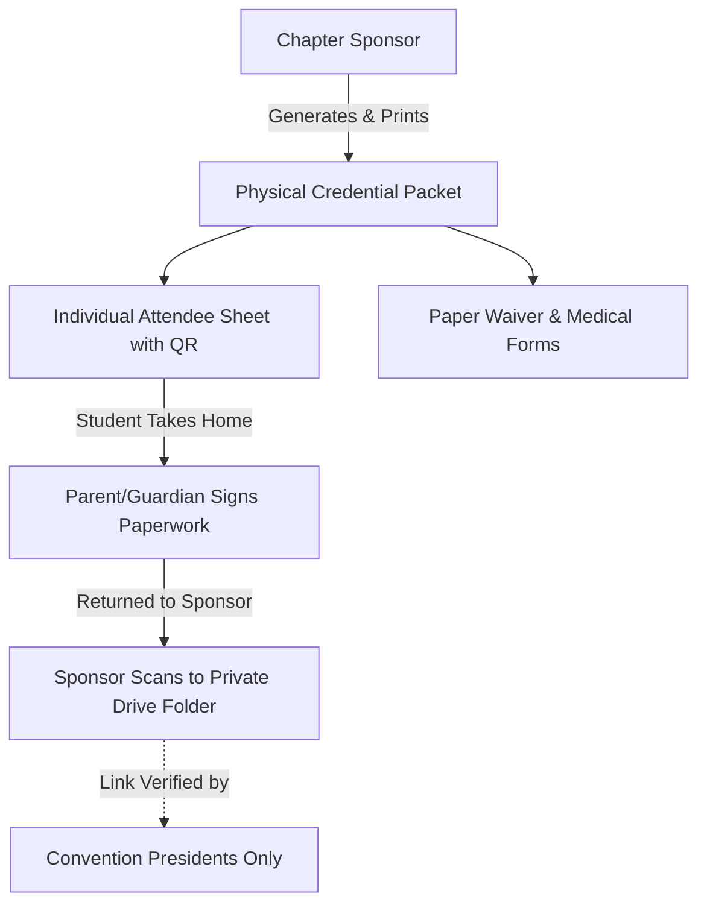

# Product Requirements Document (PRD) & Functional Specification

**Platform:** 72nd Annual CAJCL State Convention Platform (`state.uhsjcl.org`)  
**Target Release:** March 12–13, 2027 (University High School, Irvine, CA)  
**Document Classification:** Product Requirements & Functional System Specification  
**Audience:** Product Managers, Engineering Leads, Convention Board Officers  

---

## 1. Product Vision & Executive Summary

The CAJCL Convention Platform is an integrated digital portal designed to administer registration, credentialing, competition management, and financial reconciliation for the annual California Junior Classical League State Convention.

### Core Objectives
1. **Frictionless Chapter Ingestion:** Empower sponsors to import unformatted attendee lists with intelligent name-parsing heuristics and zero data corruption.
2. **Privacy-by-Design Credentialing:** Eliminate standard passwords for minors; authenticate via single-use, high-entropy access codes distributed via physical packets.
3. **Double-Blind Academic Evaluation:** Provide an end-to-end digital submission and judging workflow for pre-convention arts and creative writing that eliminates evaluator bias.
4. **Resilient Financial Reconciliation:** Maintain a deterministic, immutable accounting ledger that handles no-refund cancellations and complimentary adult ratios without manual arithmetic.

---

## 2. User Personas & Access Control Matrix

System permissions adhere to a strict Role-Based Access Control (RBAC) model:

| User Persona | Role Identifier | Granted Scopes | Functional Boundaries |
| :--- | :--- | :--- | :--- |
| **Anonymous Public** | *Unauthenticated* | *None* | Accesses landing page, theme, schedule overview, cached statistics. |
| **Student Delegate** | `delegate` | `delegate` | Submits personal digital activity sheet; uploads contest entries; views schedule. |
| **Chapter Leader** | `chapter_leader` | `delegate`, `chapter` | Delegate privileges plus registration of chapter athletic teams and publicity portfolio. |
| **Chapter Sponsor** | `sponsor` | `sponsor` | Roster ingestion, credential printing, chapter invoice review, form attestations. |
| **Adult Chaperone** | `chaperone` | `delegate` (adult form) | Submits adult profile, meal preferences, and volunteer availability. |
| **Registration Chair**| `registration_chair` | `registration` | State-wide roster management, check-in operations, ledger payment recording. |
| **Academics Chair** | `academics_chair` | `academics` | Exam catalog configuration, contest management, test material preparations. |
| **Contest Judge** | `judge` | `judge` | Blind evaluation of pre-convention contest submissions (`Entry N`). |
| **Awards Chair** | `awards_chair` | `awards` | Score tabulation, sweepstakes calculation, award certificate generation. |
| **Convention President**| `admin` | `*` (Superadmin) | Global system configuration, role provisioning, audit trail review, raw data export. |

---

## 3. Identity Model & Credential Lifecycle

### Credential Structure
Every attendee is provisioned a permanent 13-character identifier (`PPP-XXXXX-XXXXX`):
- `SPO`: Chapter Sponsor / Primary Teacher Contact
- `DEL`: Student Delegate (Grades 6–12)
- `VOL`: Adult Chaperone / Volunteer

### Security & Privacy Guardrails
1. **Zero Cleartext Credentials:** Access codes are persisted strictly as `HMAC-SHA256(CODE_PEPPER, code)`. Stolen databases cannot yield plain credentials.
2. **Zero Student Emails:** The system explicitly forbids capturing student email addresses. All communications route through chapter sponsors.
3. **Session Revocation:** Credential reissuance immediately voids the previous code and invalidates all active sessions across client devices.

---

## 4. Chapter Provisioning & Sponsor Onboarding

1. **State Database Coordination:** Following notification from the state CAJCL database, administrators provision the chapter in the platform (School Name, City, Division).
2. **Division Isolation:** If an institution sends both middle and high school delegations, **two distinct chapters are created** (e.g., *Northwood MS* and *Northwood HS*) to maintain grade-level and testing eligibility boundaries.
3. **Billing Exemption:** The Senior Classical League (SCL) is designated as an exempt organization (`billing_exempt = 1`), automatically zeroing invoice obligations.
4. **Credential Dispatch:** Administrators issue the initial sponsor access code via the verified launch email template.
5. **Join Code:** Every chapter is created with an 8-character **join code** (open by default). The chair sees it on the confirmation panel, on the chapter's *Join code* button, and in the *Add the sponsor* confirmation, and forwards it to the sponsor in the same email as the sponsor's access code. See §4a.

---

## 4a. Student Self-Registration by Join Code (preferred)

A sponsor rarely knows which students are coming until paper packets are in hand. Instead of pasting a roster first, the sponsor prints a one-page **join sheet** (join code, QR, instructions) for as many students as they expect, with the paper forms behind it.

```text
Student: #/join (code + name + grade + Latin level) ──> account + access code (shown once) ──> signed in, PENDING
Sponsor: roster ▸ "Waiting for approval" ──> Approve (counts everywhere)  |  Deny (all data removed)
```

- **The join code is not a secret like an access code.** It is stored as-is so the sponsor can read it at any time. It can only create a *pending delegate in that one chapter*. Sponsors can **close/reopen** joining (code kept) or **replace** the code (old one dies instantly; students who already joined are untouched). A chapter holds at most 150 pending students.
- **Access codes are unchanged.** The student receives an ordinary `DEL-` access code, hashed like any other and used to sign in. The difference is only how they get it.
- **Pending is not blocked.** A pending student fills in their activity sheet at once. Their registration is marked **preliminary**: it is excluded from the invoice, the public delegate count, meal totals, completion figures, academics entry counts and the packet. It *is* visible to chairs (roster, Chapters and Overview show a separate preliminary count).
- **Approval** moves the student into every figure. **Denial** runs the existing redaction: every personal field, sessions, code, form answers, contest entries and audit-log mentions are removed, leaving an anonymous `denied` row (the audit log and person numbers point at `people.id`).
- **Duplicates** (same first and last name, approved or pending, in the chapter) are refused with directions to ask the sponsor for a new code.
- **Pasting a roster remains fully supported** and produces already-approved people.

---

## 5. Roster Ingestion & Intelligent Parsing Engine

The roster import interface allows sponsors to paste unformatted attendee text (from spreadsheets, PDFs, or word processors):

```text
Input Stream (Spreadsheet / Text) ──> Linear Parser Heuristic ──> Interactive Preview Modal ──> Signed Commit
```

### Parsing Heuristics & Rules
- **Particle & Suffix Folding:** Compound particles (`de la`, `van der`, `von`) automatically fold into surnames. Suffixes (`Jr.`, `III`) route to designated suffix attributes.
- **Capitalization Preservation:** Preserves mixed casing to prevent mangling names like `McDonald` or `de la Cruz`. Uniformly upper/lower-case entries receive conservative Title Casing.
- **Zero-Persistence Previews:** Roster parsing operates in-memory; preview generation writes zero records to the database.
- **Idempotency Protection:** Commit requests transmit an HMAC-signed token binding `school_id`, payload hash, and target roster state fingerprint. Concurrent or duplicate requests cannot create duplicate records.

---

## 6. Physical Credential Packets & Form Separation



- **Physical Paperwork Isolation:** Signed liability waivers and medical forms reside strictly on paper and within a private Google Drive folder accessible solely by Convention Presidents. **Zero medical data enters the application database.**
- **Portal Attestation:** Chapter sponsors verify receipt of physical documents via digital checkboxes on their dashboard, satisfying compliance gating without exposing health records.

---

## 7. Digital Form Workflows

### Student Activity Sheet (Delegates)
- **Academic Testing:** Selection of 1 to 3 competitive exams (hard validation limit). Exam availability dynamically filters based on enrolled Latin level (e.g., Grammar 1 restricted to MS-1/2 and HS-1).
- **Creative & Graphic Arts:** Registration across 14 artistic divisions (Drawing, Painting, Mosaic, etc.).
- **Athletics (*Olympika*):** Individual event entry (Track, Swimming, Chess). Team competitions (Kickball, Ultimate Frisbee) are registered exclusively at the chapter level.
- **Campus Games (*Ludi*):** Open Certamen, Trivia, and non-academic competitions.

### Adult Registration Sheet (Chaperones & Sponsors)
- Ingests adult contact details (Email, Mobile Phone).
- Captures Latin language competency across four defined tiers: *None*, *Novice*, *Intermediate*, *Advanced*.
- Captures volunteer event preferences (*Wherever Needed*, *Certamen Reader*, *Art Judge*, etc.) with flexible free-text scheduling notes.

---

## 8. Invoicing & Financial Ledger Engine

The platform calculates chapter fees dynamically:

$$\text{Total Invoice} = (\$140 \times \text{Delegates}) + \max(0, \$75 \times (\text{Adults} - \lceil\text{Delegates} / 10\rceil)) - \text{Discount}$$

### Ledger Governance Rules
1. **Complimentary Chaperone Ratios:** 1 complimentary chaperone per 10 registered delegates (e.g., 1–10 delegates = 1 free adult; 11–20 delegates = 2 free adults).
2. **Immutable Transactions:** Payments are strictly append-only. Corrections are processed via signed negative entries (`-$X.XX`).
3. **No-Refund State Handling:**
   - Pre-Payment Cancellation $\rightarrow$ Record marked `cancelled`; fee dropped from invoice.
   - Post-Payment Cancellation $\rightarrow$ Record marked `cancelled_paid`; fee retained on invoice to ensure ledger reconciles with bank receipts.

---

## 9. Academic Competition & Double-Blind Judging

1. **Digital File Uploads:** Delegates upload creative submissions (Art, Poetry, Myths) through the portal. Files are validated for MIME type, capped at 20 MB, and archived to Google Drive via an authenticated webhook puppet.
2. **Double-Blind Evaluation:** Evaluators holding the `judge` role view submissions strictly as `Entry N`. Names, school affiliations, and metadata are stripped.
3. **Separation of Duties:** Administrators holding `academics` scope are barred from holding `judge` roles to preserve competitive integrity.
4. **Automated Tabulation:** Judges submit ranked ballots. Points calculate automatically based on placement weights, breaking ties via highest first-place finishes.

---

## 10. Appendix: Roster Parser Test Fixture

The parser must successfully process this standard stress fixture without throwing unhandled exceptions:

```text
Aurelia Vance	9	HS-1
Marcus DeLuca	10	HS-2
Priya Raghunathan	11	HS-3
Chen, Wei-Lin	9	HS-1
Okonkwo, Ngozi A.	12	HS-Adv
Sofia van der Berg	10	HS-2
Jamal Washington III	11	HS-3
Elena Marie Castellanos	9	HS-1
theodore huang	10	HS-2
MIRANDA OYELARAN	12	HS-Adv
Rafael Ortiz-Mendoza	11	HS-3
Yuki Tanaka	9	HS-1
1. Amara Nwosu	10	HS-2
2. Dmitri Volkov, Jr.	12	HS-Adv
3. Isabella Rossi	11	HS-3
Aurelia Vance	9	HS-1
```
